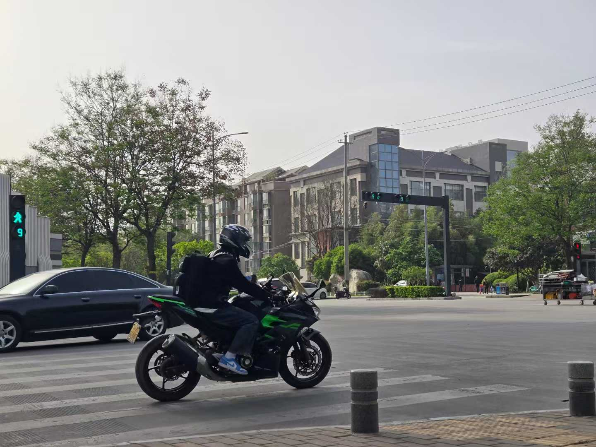

你好啊，我是ren517(任泊睿)，至于为什么叫这个名字，起始是因为github上本来就像取我的姓氏ren，但是github上已经有人叫ren了，随便按了几个键，后面由于统一，也懒得改，就先这么弄着吧。

我喜欢打算法比赛，但是感觉自己能力又不足，现在从事AI(机器学习)的一些预测，当一个学术小水鱼。博客内容可能让大佬们见笑了，但我想就当做自己学习的过程吧。总会经历这些才能学到更多，后面我会记录一些自己的生活日常，也不光是技术内容的分享。

除了编程外，我个人也有很多的爱好，我喜欢摄影，喜欢户外运动。感觉在室外我的心情会更好。同时我也是一个机车发烧友，放一张我骑车的照片。

联系我：
github：

- https://github.com/ren517

我来自西安科技大学，如果你是我的校友，也欢迎和我讨论，或者相关的比赛也可以组队。可以通过下面邮箱联系我。

邮箱: rb12138.r@gmail.com
