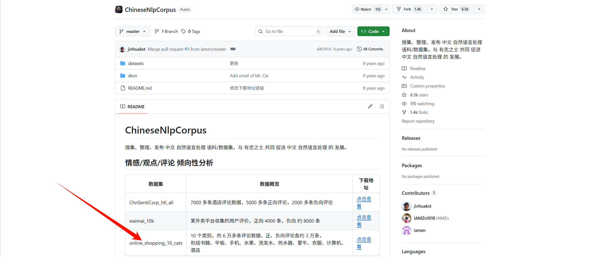
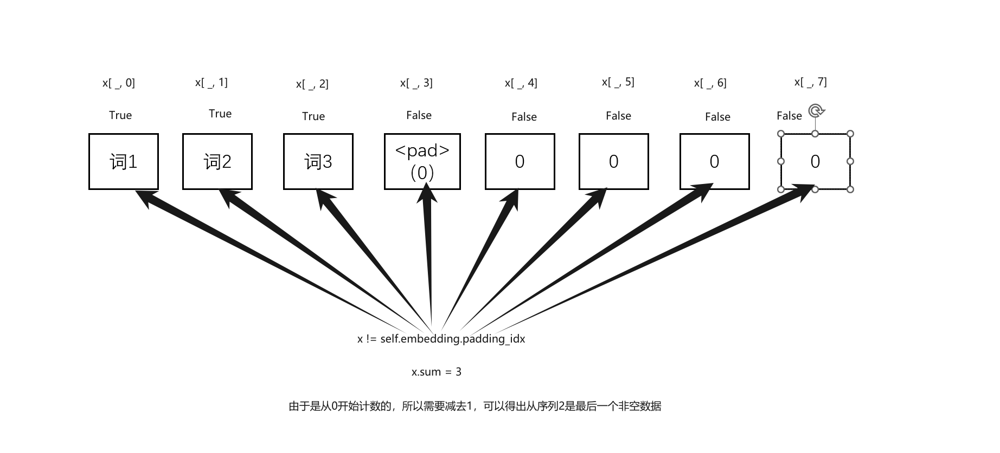
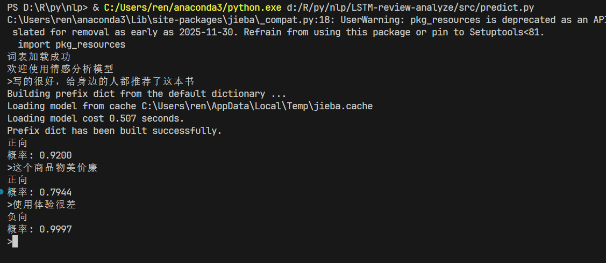
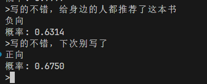

+++
author = "ren517"
title = "LSTN预测文本情感"
date = "2026-03-28"
description = "利用LSTM处理nlp分类任务"
tags = [
    "pytorch",
    "LSTM",
    "机器学习",
]
categories = [
    "pytorch",
    "机器学习",
]
series = ["Themes Guide"]
+++

本文将利用LSTM处理nlp分类任务，数据集为各大平台的评论，经过训练后，可以预测一句话的情感是否为正。

### 1.准备数据集

数据集来源于github [https://github.com/SophonPlus/ChineseNlpCorpus](https://github.com/SophonPlus/ChineseNlpCorpus)



### 2.创建项目结构
创建项目结构如下：
```bash
 📁 目录结构

   LSTM-review-analyze/
   ├── data/                    # 数据目录
   │   ├── raw/                # 原始数据
   │   └── processed/          # 处理后的数据 (train.jsonl, test.jsonl)
   │
   ├── models/                 # 模型存储目录
   │   ├── model.pth          # 训练好的模型权重
   │   └── vocab.txt          # 词汇表
   │
   ├── src/                    # 源代码目录
   │   ├── config.py          # 配置文件（超参数）
   │   ├── model.py           # LSTM模型定义
   │   ├── dataset.py         # 数据加载器
   │   ├── tokenizer.py       # Jieba分词器
   │   ├── train.py           # 训练脚本
   │   ├── predict.py         # 预测脚本
   │   └── process.py         # 数据处理
   │
   └── logs/                   # TensorBoard日志目录
```

### 3.数据处理

设置config.py文件，设置超参数。

```python
from pathlib import Path

ROOT_DIR = Path(__file__).parent.parent

RAW_DATA_DIR = ROOT_DIR / "data" / "raw"
PROCESSED_DATA_DIR = ROOT_DIR / "data" / "processed"
LOGS_DIR = ROOT_DIR / "logs"
MODELS_DIR = ROOT_DIR / "models"

SEQ_LEN = 128
BATCH_SIZE = 64
EMBEDDING_DIM = 128
HIDDEN_SIZE = 256
LEARNING_RATE = 1e-3
EPOCHS = 10
```

导入tokenizer.py文件

```python
import jieba
from tqdm import tqdm


class JiebaTokenizer:
    unk_token = "<unk>"
    pad_token = "<pad>"

    def __init__(self, vocab_list):
        self.vocab_list = vocab_list
        self.vocab_size = len(vocab_list)
        self.word2index = {word: index for index, word in enumerate(vocab_list)}
        self.index2word = {index: word for index, word in enumerate(vocab_list)}
        self.unk_token_index = self.word2index[self.unk_token]
        self.pad_token_index = self.word2index[self.pad_token]

    @staticmethod
    def tokenize(text):
        return jieba.lcut(text)

    def encode(self, text, seq_len):
        tokens = self.tokenize(text)
        # 截取或填充
        if len(tokens) > seq_len:
            tokens = tokens[:seq_len]
        elif len(tokens) < seq_len:
            tokens += [self.pad_token] * (seq_len - len(tokens))

        return [self.word2index.get(token, self.unk_token_index) for token in tokens]

    @classmethod
    def build_vocab(cls, sentences, vocab_path):
        vocab_set = set()
        for sentence in tqdm(sentences, desc="构建词表"):
            vocab_set.update(jieba.lcut(sentence))

        vocab_list = [cls.pad_token, cls.unk_token] + [
            token for token in vocab_set if token.strip() != ""
        ]
        print(f"词表大小:{len(vocab_list)}")

        # 保存词表
        with open(vocab_path, "w", encoding="utf-8") as f:
            f.write("\n".join(vocab_list))

        return cls(vocab_list)

    @classmethod
    def from_vocab(cls, vocab_path):
        """
        从文件加载词汇表并创建 Tokenizer 实例
        :param cls: 类本身
        :param vocab_path: 词汇表文件的路径 (例如 'vocab.txt')
        :return: JiebaTokenizer 实例
        """
        with open(vocab_path, "r", encoding="utf-8") as f:
            # 读取每一行，去掉首尾空白符（如换行符 \n）
            vocab_list = [line.strip() for line in f.readlines()]

        # 使用读取到的列表初始化类实例
        return cls(vocab_list)

    def decode(self, indices):
        """将索引序列解码回词语列表"""
        return [self.index2word.get(idx, self.unk_token) for idx in indices]

    def save(self, path):
        """保存词汇表到文件"""
        with open(path, "w", encoding="utf-8") as f:
            for word in self.vocab_list:
                f.write(word + "\n")

    @classmethod
    def load(cls, path):
        """从文件加载词汇表并创建 tokenizer 实例"""
        with open(path, "r", encoding="utf-8") as f:
            vocab_list = [line.strip() for line in f if line.strip()]
        return cls(vocab_list)
```

编写创建数据处理脚本process.py

```python
import config
import pandas as pd
from sklearn.model_selection import train_test_split
from tokenizer import JiebaTokenizer


def process():
    print("开始处理数据")
    df = (
        pd.read_csv(
            config.RAW_DATA_DIR / "online_shopping_10_cats.csv",
            usecols=["label", "review"], # 选择列，用label和review列
            encoding="utf-8",
        )
        .dropna()  # 删除DataFrame中包含缺失值的行或列
        .sample(frac=1)  # 取100%数据
    )

    # 划分数据集
    train_df, test_df = train_test_split(df, test_size=0.2, stratify=df["label"]) # stratify 按label分层抽样

    # 构建词表
    JiebaTokenizer.build_vocab(
        (train_df["review"].tolist()), vocab_path=config.MODELS_DIR / "vocab.txt"
    )

    # 创建tokenizer
    tokenizer = JiebaTokenizer.from_vocab(config.MODELS_DIR / "vocab.txt")

    # 计算序列长度
    # max_len = train_df["review"].apply(lambda x: len(tokenizer.tokenize((x)))).quantile(0.95) # 取整为128
    # 编码训练集
    train_df["review"] = train_df["review"].apply   (lambda x: tokenizer.encode(x, 128))

    # 导出训练集
    train_df.to_json(
        config.PROCESSED_DATA_DIR / "train.jsonl",
        orient="records",
        lines=True,
    )  # lines = True 表示每行是一个JSON对象 为jsonl文件， 没有换行符和方括号

    # 编码测试集
    test_df["review"] = test_df["review"].apply(lambda x: tokenizer.encode(x, 128))
    # 导出测试集
    test_df.to_json(
        config.PROCESSED_DATA_DIR / "test.jsonl",
        orient="records",
        lines=True,
    )

    print("数据处理完成")


if __name__ == "__main__":
    process()
```

运行process.py文件，生成训练集和测试集。
```bash
data/                    # 数据目录
   │   ├── raw/                # 原始数据
   │   └── processed/          # 处理后的数据 (train.jsonl, test.jsonl)
   │    | test.jsonl
   │    | train.jsonl
   └── 
```

### 4.创建数据加载器
创建数据加载器dataset.py
```python
import config
import pandas as pd
import torch
from torch.utils.data import DataLoader, Dataset


class ReviewAnalyzeDataset(Dataset):
    def __init__(self, path):
        self.data = pd.read_json(path, lines=True, orient="records").to_dict(
            orient="records"
        )  # data设置为字典类型

    def __len__(self):
        return len(self.data)

    def __getitem__(self, index):
        input_tensor = torch.tensor(self.data[index]["review"], dtype=torch.long)
        # BCEWithLogitsLoss 需要标签为 float 类型
        target_tensor = torch.tensor(self.data[index]["label"], dtype=torch.float)
        return input_tensor, target_tensor


def get_dataloader(train=True):
    path = config.PROCESSED_DATA_DIR / ("train.jsonl" if train else "test.jsonl")
    dataset = ReviewAnalyzeDataset(path)
    return DataLoader(dataset, batch_size=config.BATCH_SIZE, shuffle=True)
# shuffle 打乱数据

if __name__ == "__main__":
    train_dataloader = get_dataloader(train=True)
    test_dataloader = get_dataloader(train=False)
    print(len(train_dataloader))
    print(len(test_dataloader))

    for input_tensor, target_tensor in train_dataloader:
        print(input_tensor.shape)
        print(target_tensor.shape)
        break
```

运行dataset.py文件，测试数据加载器。

```bash
785
197
torch.Size([64, 128])
torch.Size([64])
```

### 5.创建模型
创建模型model.py
```python
import config
import torch
from torch import nn


class ReviewAnalyzeModel(nn.Module):
    def __init__(self, vocab_size, padding_index):
        super(ReviewAnalyzeModel, self).__init__()
        self.embedding = nn.Embedding(
            vocab_size, config.EMBEDDING_DIM, padding_idx=padding_index
        )
        self.lstm = nn.LSTM(
            input_size=config.EMBEDDING_DIM,
            hidden_size=config.HIDDEN_SIZE,
            batch_first=True,
        )
        self.linear = nn.Linear(config.HIDDEN_SIZE, 1)

    def forward(self, x):
        # x.shape = [batch_size, seq_len]
        embed = self.embedding(x)
        # embed.shape = [batch_size, seq_len, embedding_dim]
        output, (_, _) = self.lstm(embed)
        # output.shape = [batch_size, seq_len, hidden_size]

        # 取出最后一个时间步的隐藏状态
        batch_indexs = torch.arange(0, output.shape[0])
        # output = output[:, -1, :] # 由于x中第二维有很多0填充，需要改善
        lengths = (x != self.embedding.padding_idx).sum(
            dim=1
        ) - 1  # 计算每个样本的实际长度，减去1得到最后一个非0位置的索引
        # 取出最后一个时间步的隐藏状态
        last_hidden = output[batch_indexs, lengths]
        # last_hidden.shape = [batch_size, hidden_size]
        output = self.linear(last_hidden)
        return output.squeeze(-1)  # output.shape = [batch_size]
```

定义embedding层

```python
self.embedding = nn.Embedding(
            vocab_size, config.EMBEDDING_DIM, padding_idx=padding_index
        )
        # vocab_size 表示有多少个单词，padding_idx 表示填充的索引
        # embedding_dim 表示每个单词的维度 这个在前面计算得出为128
```

定义LSTM层

```python
self.lstm = nn.LSTM(
            input_size=config.EMBEDDING_DIM,
            hidden_size=config.HIDDEN_SIZE,
            batch_first=True,
            # 设置batch_first=True意味着输入和输出的张量形状为 (batch, seq, feature)，这使得处理批量数据时更符合直觉
        )
```

定义全连接层
线性层Linear

```python
self.linear = nn.Linear(config.HIDDEN_SIZE, 1)
```

**计算句子的实际长度**

```python
lengths = (x != self.embedding.padding_idx).sum(
            dim=1
        ) - 1  # 计算每个样本的实际长度，减去1得到最后一个非0位置的索引
```

如图示



```python
output.squeeze(-1)
# output.shape = [batch_size]
```

### 6.训练模型
创建训练模型train.py
```python
import time

import config
import torch
from dataset import get_dataloader
from model import ReviewAnalyzeModel
from tokenizer import JiebaTokenizer
from torch.utils.tensorboard import SummaryWriter
from tqdm import tqdm


def train_one_epoch(model, dataloader, loss_fn, optimizer, device):
    total_loss = 0
    model.train()
    for inputs, targets in tqdm(dataloader, desc="Training"):
        inputs = inputs.to(device)  # inputs.shape = [batch_size, seq_len]
        targets = targets.to(device)  # targets.shape = [batch_size]
        output = model(inputs)
        loss = loss_fn(output, targets)

        loss.backward()
        optimizer.step()
        optimizer.zero_grad()
        total_loss += loss.item()
    return total_loss / len(dataloader)


def train():
    # 1.设备
    device = torch.device("cuda" if torch.cuda.is_available() else "cpu")
    # 2.数据
    dataloader = get_dataloader()
    # 3.分词器
    tokenizer = JiebaTokenizer.from_vocab(config.MODELS_DIR / "vocab.txt")
    # 4.模型
    model = ReviewAnalyzeModel(tokenizer.vocab_size, tokenizer.pad_token_index).to(
        device
    )
    # 5.损失函数
    loss_fn = torch.nn.BCEWithLogitsLoss()
    # 6.优化器
    optimizer = torch.optim.Adam(model.parameters(), lr=config.LEARNING_RATE)
    # 7.Tensorboard Writer
    writer = SummaryWriter(log_dir=config.LOGS_DIR / time.strftime("%Y-%m-%d-%H-%M-%S"))

    best_loss = float("inf")
    # 8.训练
    for epoch in range(1, config.EPOCHS + 1):
        print(f"========= Epoch {epoch} =========")
        loss = train_one_epoch(model, dataloader, loss_fn, optimizer, device)  # noqa: F821
        print(f"loss: {loss:.4f}")

        writer.add_scalar("loss", loss, epoch)  # 添加loss到Tensorboard

        # 保存模型
        if loss < best_loss:
            best_loss = loss
            torch.save(model.state_dict(), config.MODELS_DIR / "model.pth")
            print("模型已保存！")

    writer.close()


if __name__ == "__main__":
    train()
```

函数train_one_epoch()
训练一个epoch

```python
def train_one_epoch(model, dataloader, loss_fn, optimizer, device):
    total_loss = 0
    model.train()
    # tqdm用于显示进度条
    for inputs, targets in tqdm(dataloader, desc="Training"):
        inputs = inputs.to(device)  # inputs.shape = [batch_size, seq_len]
        targets = targets.to(device)  # targets.shape = [batch_size]
        output = model(inputs)
        loss = loss_fn(output, targets)

        # 反向传播
        loss.backward()
        # 优化器更新参数
        optimizer.step()
        # 梯度清零
        optimizer.zero_grad()
        # 计算loss
        total_loss += loss.item()
    return total_loss / len(dataloader)
```


### 7.预测结果

创建预测模型predict.py

```python
import config
import torch
from model import ReviewAnalyzeModel
from tokenizer import JiebaTokenizer


def predict_batch(model, input_tensor):
    model.eval()
    with torch.no_grad():
        # 传入模型
        outputs = model(input_tensor)
        # output.shape = [batch_size]
        # 将输出映射到[0,1]
        outputs = torch.sigmoid(outputs)
        batch_result = outputs.cpu().numpy()
    return batch_result.tolist()


def predict(text, model, tokenizer, device):
    # 1.处理输入
    # 将输入转为tensor
    indexes = tokenizer.encode(text, config.SEQ_LEN)
    # indexes.shape = [seq_len]
    input_tensor = torch.tensor([indexes], dtype=torch.long)
    # input_tensor.shape = [1, seq_len]
    input_tensor = input_tensor.to(device)

    # 2.预测逻辑
    batch_result = predict_batch(model, input_tensor)

    return batch_result[0]


def run_predict():
    # 1.设备
    device = torch.device("cuda" if torch.cuda.is_available() else "cpu")

    # 2.词表
    tokenizer = JiebaTokenizer.from_vocab(config.MODELS_DIR / "vocab.txt")
    print("词表加载成功")

    # 3.模型

    # 模型参数设置
    model = ReviewAnalyzeModel(tokenizer.vocab_size, tokenizer.pad_token_index).to(
        device
    )

    # 模型选择
    model.load_state_dict(
        torch.load(config.MODELS_DIR / "model.pth", map_location=device)
    )

    print("欢迎使用情感分析模型")

    while True:
        user_input = input(">")

        if user_input in ["q", "quit"]:
            print("退出程序")
            break

        if user_input.strip() == "":
            print("输入不能为空，请重新输入")
            continue

        result = predict(user_input, model, tokenizer, device)

        if result > 0.5:
            print("正向")
            print(f"概率: {result:.4f}")
        else:
            print("负向")
            print(f"概率: {1 - result:.4f}")


if __name__ == "__main__":
    run_predict()
```

运行predict.py

可以看到，在简单任务上表现还不错



但在稍微绕一点的语句上，结果会很差



后续会利用其他模型继续训练，下一个将会评估我这个模型