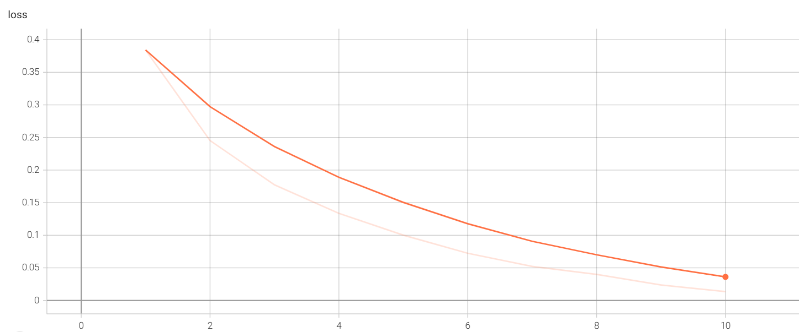
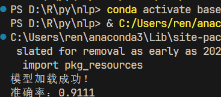

+++
author = "ren517"
title = "LSTN预测文本情感的模型评估"
date = "2026-03-28"
description = "利用测试集评估LSTM模型"
tags = [
    "pytorch",
    "LSTM",
    "机器学习",
]
categories = [
    "pytorch",
    "机器学习",
]
series = ["Themes Guide"]
+++

上节，我用到了LSTM模型对文本进行分类，并成功训练了模型。
本次我来完成模型评估。

分析之前训练的模型，利用tensorboard查看logs
可以看到loss从0.3843下降到了0.0136，效果非常不错。



原理： 对测试集进行预测，计算预测结果与真实结果之间的差异，计算出准确率。

创建evaluate.py文件

```python
import config
import torch
from dataset import get_dataloader
from model import ReviewAnalyzeModel
from predict import predict_batch
from tokenizer import JiebaTokenizer


def evaluate(model, test_dataloader, device):
    model.eval()  # 设置模型为评估模式
    total_count = 0
    correct_count = 0
    # 评估逻辑
    for inputs, targets in test_dataloader:
        inputs, targets = inputs.to(device), targets.to(device)
        target = targets.tolist()
        batch_result = predict_batch(model, inputs)
        # batch_result.shape = [batch_size]
        # target.shape = [batch_size]
        for result, target in zip(batch_result, target):  # 将预测结果和真实标签进行配对
            if result >= 0.5:
                result = 1
            elif result < 0.5 and result >= 0:
                result = 0

            total_count += 1
            if result == target:
                correct_count += 1

    accuracy = correct_count / total_count if total_count > 0 else 0
    return accuracy


def run_evaluate():
    # 确定设备
    device = "cuda" if torch.cuda.is_available() else "cpu"
    # 词表
    tokenizer = JiebaTokenizer.from_vocab(config.MODELS_DIR / "vocab.txt")
    # 模型
    model = ReviewAnalyzeModel(
        vocab_size=tokenizer.vocab_size, padding_index=tokenizer.pad_token_index
    ).to(device)
    model.load_state_dict(torch.load(config.MODELS_DIR / "model.pth"))
    print("模型加载成功！")

    # 数据集
    test_dataloader = get_dataloader(train=False)

    # 评估逻辑
    acc = evaluate(model, test_dataloader, device)
    print(f"准确率：{acc:.4f}")


if __name__ == "__main__":
    run_evaluate()

```

运行evaluate.py文件，结果如下：



可以看到LSTM准确率还不错，后续会利用bert，Transformer等模型进行对比。