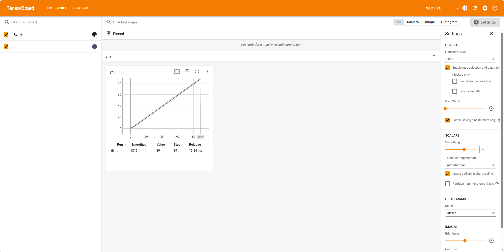
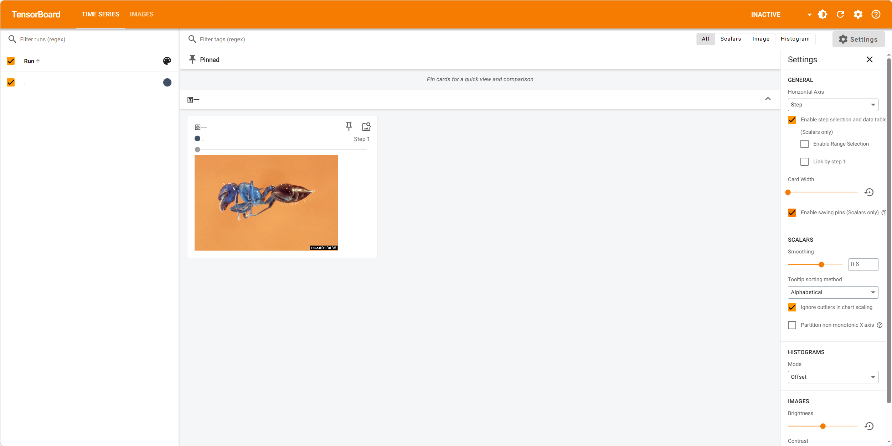

+++
author = "ren517"
title = "Tensorboard的使用"
date = "2026-03-16"
tags = [
    "pytorch",
    "tensor",
    "机器学习",
]
categories = [
    "pytorch",
    "机器学习",
]
series = ["Themes Guide"]
+++

TensorBoard 是由 Google 开发、随 TensorFlow 一起提供的一个可视化工具，主要用来帮助你观察深度学习模型训练过程中的各种数据（比如 loss、准确率、网络结构等）。现在不仅 TensorFlow，可以配合 PyTorch 使用。同时，在论文中也被广泛使用。

### pytorch里面怎么用

导包
```bash
pip install torch
pip install tensorboard
```

基本使用语法

```python
from torch.utils.tensorboard import SummaryWriter
writer = SummaryWriter("my_experiment")
for i in range(100):
    writer.add_scalar("y=x", i, i)

writer.close()
```

运行后可以看见项目中多了一个 my_experiment 文件夹，里面有 events.out.tfevents.1629318657.DESKTOP-HJDJJ0H.log 文件。  
现在需要运行该文件，使用bash命令
```bash
tensorboard --logdir=my_experiment
```
在浏览器中打开
```bash
http://localhost:6006
```

可以看到




导入图片

```python
from torch.utils.tensorboard import SummaryWriter
import cv2
import numpy as np

writer = SummaryWriter("run")
img = cv2.imread("dataset\\train\\ants_image\\0013035.jpg")
img = img.transpose(2,0,1)
print(img.shape)

writer.add_image("图一", img, 1)
writer.close()
```

**注意**：输入的图片数据格式为[C,H,W]，C为通道数，H为高度，W为宽度。所以需要用transpose进行转换。
方案二

```python
writer.add_image("图一", img, 0, dataformats="HWC")
```

