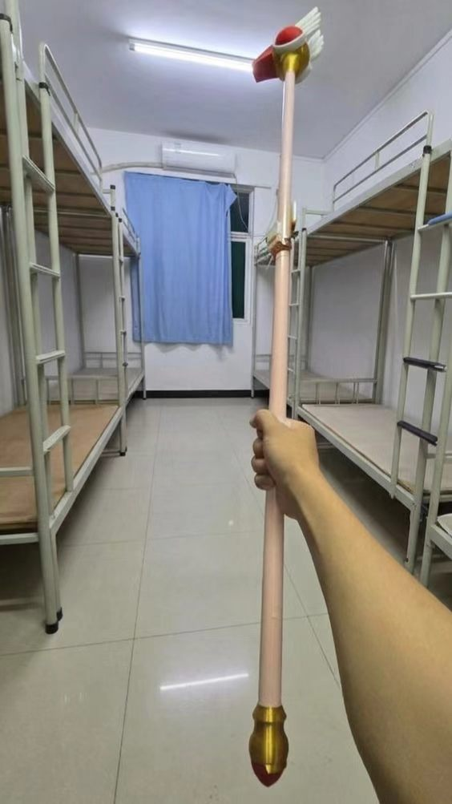
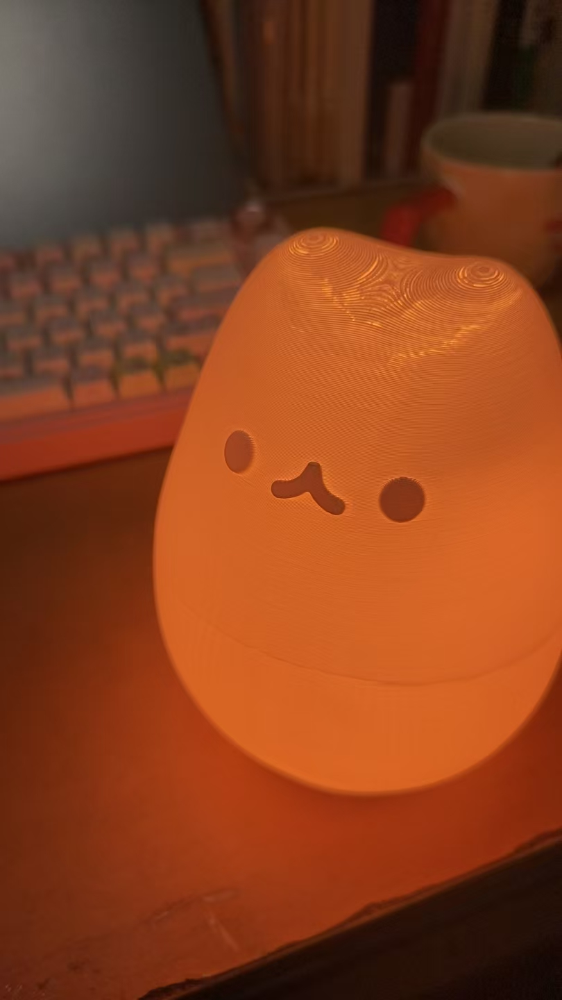

+++
author = "ren517"
title = "esp32C3灯带项目"
date = "2026-09-22"
description = "该项目分为发射端和接收端，发射端利用 espc3minisuper，接收端利用 espc3 经典款，灯带利用开源项目 WLED。目的为发射端利用颜色传感器获得物理颜色，发射到接收端上，改变其颜色。"
tags = [
    "嵌入式",
]
categories = [
    "教程",
]
series = ["Themes Guide"]
+++

## 前期准备

| 材料               | 个数 | 备注                                         |
| ------------------ | ---- | -------------------------------------------- |
| esp32C3minisuper   | 2    | 一个焊接，用于测试（可不选），成品用不焊接的 |
| esp32C3            | 1    | 接收端                                       |
| 杜邦线             | 若干 | 连线                                         |
| TCS34725 颜色传感器 | 1    |                                              |

## 开发环境

**发射端**：Arduino IDE

- [color](https://github.com/ren517/my_led/blob/main/color/color.ino)

**接收端**：vscode + platformIO

- [WLED-0.15.3](https://github.com/wled/WLED/releases#release-v0.15.3)

## 项目分析

因为我的主要方向并不是搞硬件，所以在这个项目里也踩了不少坑，希望记录下来的这些经验对大家能有所帮助。

一开始，我与 ChatGPT 确定了方案：先用蓝牙在两个开发板之间进行通信，只写一些基础的 demo，暂不接入 WLED 测试。起初的几天进展特别顺利，这也极大地增强了我的信心。但真正接入 WLED 之后，只能利用项目开放的接口来操作，事情就复杂了许多。

接入 WLED 后，我经历了不少尝试。最初我想用 ESP-NOW 连接两个开发板，并利用 WLED 提供的 usermods 加入一个接收模块。在经历了大约两三小时的反复试错后，我先放弃了这个方案。接着 AI 给我推荐了一种更简单的思路：通过 HTTP 传递数据——接收端监听 `4.3.2.1:80` 端口，发射端向这个地址发起 TCP 连接来传输信息。然而这个方案做出来后，稳定性极差，延时也很久，于是我又放弃了它，回头继续死磕 ESP-NOW（后来我才发现，这完全是个灾难！）。

紧接着，我开始正式折腾 ESP-NOW。这个通信协议的坑非常多，我遇到了形形色色的问题，为此我还单独开了一篇文章来记录当时的踩坑经历，这里就不再赘述了。总之，这是整个项目里最困难的一步。辗转反侧了整整一周之后，我终于决定换掉这个方案。这时我突然想到：最开始用**蓝牙**写 demo 时其实非常顺利，而且既然我已经用上了 usermods，那把 ESP-NOW 的接收模块换成蓝牙，问题也许就能迎刃而解了。

最终我回归了**蓝牙**方案，在 `WLED-0.15.3\usermods\espnow_color_receiver\usermod_espnow_color.h` 中增加这个 usermod，终于解决了这个问题。

## 代码调试

这一部分相对就容易多了，得益于 AI 提供的代码大多都能正确运行，只是在用 ESP-NOW 时一直盯着串口监视器观察。不过这里同样有值得注意的地方：一开始我忽略了打印信息过多的问题，导致不监听串口时会出现打印阻塞。于是我让 AI 降低了代码的耦合度，通过宏定义来控制输出，例如 `#define DEBUG_SERIAL 0`——调试时设为 `1`，最终发布时设为 `0`，就能规避这个问题。

## 模型打印

这一部分我就不统一推荐了，毕竟各有所好。我在拓竹上找了一些模型，并通过 Bambu Studio 加入一些负零件，以便在模型内部布线。

- [灯内部模型](https://makerworld.com.cn/models/606315?appSharePlatform=copy)
- [灯壳](https://makerworld.com.cn/models/1509803?appSharePlatform=copy)
- [魔法棒](https://makerworld.com.cn/models/994679?appSharePlatform=copy)

## 成品展示

## 总结

这个魔法棒和灯带项目，前前后后折腾了 20 天，对我而言确实不是一件容易的事，但我也从中收获了很多，更感受到了实实在在的反馈。

以前搞软件，做的都是一些看得见却摸不着的东西。不过因为学过软件的很多工作流，所以学习这些对我来说也并不算难。关键在于，它能给我喜欢的人一个惊喜。放在 AI 这么普及之前，如果她看到一件很喜欢、却因为停产或者价格让我实在无法接受的东西，我只能望洋兴叹——因为要学习一系列的工作流和很多 API 接口，这些工作量完全是我无法接受的，就算有一天我学会了，可能当初的那份热情也早已消散。

但现在不一样了，我不仅能够自己动手把它做出来，还能做得比抖音上的星星灯更好：我定制了她更喜欢的魔杖，也加入了 WLED 这样的智能控制系统。也许，这就是程序员的浪漫吧。

很多时候我会抱怨自己，抱怨身边的人，为什么我不能如自己所愿地选择成为一名程序员，好像只有在大厂里、在开源项目里发光发热，才算实现了人生的价值。往大了说，确实是这样；但往小了说，给身边的人做做小东西，同样能收获很多快乐和价值。

现在回想起很多天前下单各种材料的时候，感觉时间过得真快，也感到很充实。这种第一次亲手做出一件自己喜欢的东西的感觉，真的是一种很奇妙的体验。

---

> **《青玉案·元夕》**
> 东风夜放花千树，更吹落、星如雨。
> 宝马雕车香满路。
> 凤箫声动，玉壶光转，一夜鱼龙舞。
> 蛾儿雪柳黄金缕，笑语盈盈暗香去。
> 众里寻他千百度。
> 蓦然回首，那人却在，灯火阑珊处。
>
> —— 宋·辛弃疾《青玉案·元夕》

这首词写的是元夕满城灯火，人来人往，找了好久，一回头，那个人就在灯火边上。我没什么大本事，也就只能亲手做一盏灯给她——做完之后才觉得，这样就挺好的。
