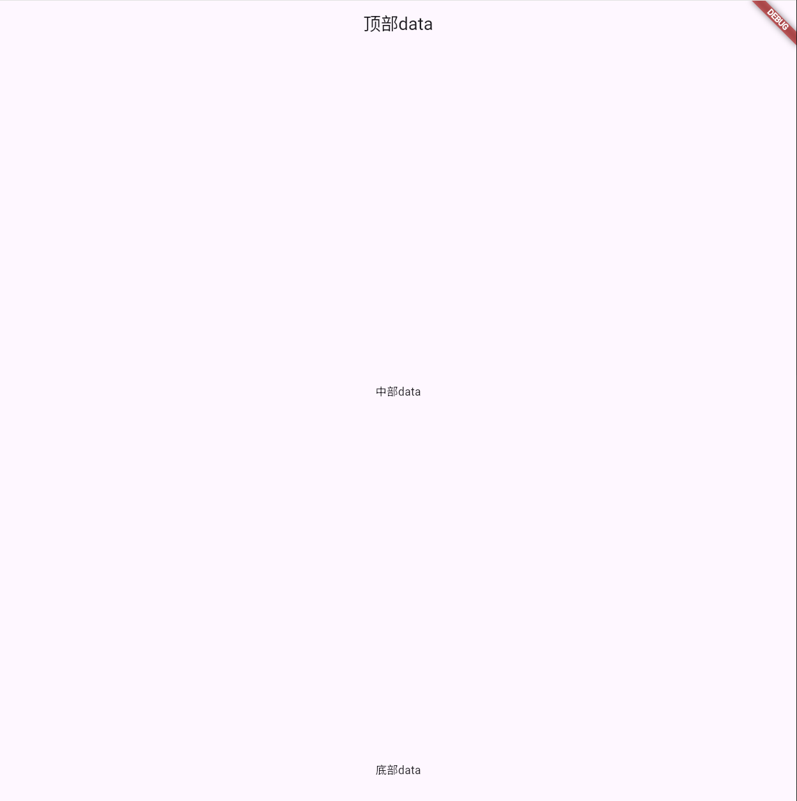

+++
author = "ren517"
title = "flutter基础框架"
date = "2026-10-7"
description = "学习Flutter"
tags = [
    "Android",
    "学习",
]
series = ["Themes Guide"]
+++

<h2>什么是Flutter</h2>
<div style="display:flex; align-items:center; gap:20px;">
  
  <div style="font-style:italic; line-height:1.8;">
    <p>Flutter 是一个用于构建跨平台应用的 UI 工具包，由 Google 开发维护。它允许开发者使用一套代码库同时为 iOS、Android、Web、Windows、macOS 和 Linux 构建原生编译的应用。</p>
    <p>Flutter 使用 Dart 编程语言，具有热重载、丰富的组件库和高性能的渲染引擎，能够帮助开发者快速构建美观、流畅的原生体验应用。</p>
  </div>
</div>

### 创建新项目

在终端中运行以下命令创建一个新的 Flutter 项目：

```
flutter create --platforms web fltter_base
```

其中 fltter_base 是你的项目名称。Flutter 会根据这个名称创建对应的文件夹和文件。

| 参数        | 说明                         | 示例                    |
| ----------- | ---------------------------- | ----------------------- |
| --org       | 制定组织标识符(反向域名格式) | --org com.example       |
| --platforms | 指定的平台                   | --olatforms ios,android |
| --empty     | 使用最小模板创建项目         | --empty                 |

#### 项目结构

```base
flutter create fltter_base
Creating project "fltter_base"...
  .gitignore                    2026-04-01 10:30:22
  .metadata                     2026-04-01 10:30:22
  analysis_options.yaml         2026-04-01 10:01:15
  pubspec.yaml                  2026-04-01 10:30:22
  README.md                     2026-04-01 10:30:22
  lib/
    main.dart                    2026-04-01 10:30:22
  test/
    widget_test.dart             2026-04-01 10:22:34
  android/
  ios/
  web/
  ...
Running "flutter pub get"...                     13.2s
Running "flutter analyze"...                     3.2s
```

运行

```base
cd hello_world
flutter run
```

#### 指定运行设备

如果你的电脑连接了多个设备（或模拟器），可以使用 `-d` 参数指定运行设备：

| 设备           | 命令                     |
| -------------- | ------------------------ |
| Android 模拟器 | `flutter run -d android` |
| iOS 模拟器     | `flutter run -d iphone`  |
| Chrome 浏览器  | `flutter run -d chrome`  |
| Windows 桌面   | `flutter run -d windows` |

#### 查看可用设备

```
flutter devices
```

## main.dart 文件解析

每个 Flutter 项目都有一个入口文件 lib/main.dart。让我们看看默认生成的内容：

#### 实例：main.dart 代码

```dart
// lib/main.dart
// Flutter 应用的入口文件

// 引入 Material Design 组件库
import 'package:flutter/material.dart';

// 应用入口函数
void main() {
  // runApp 是 Flutter 的启动函数
  // 它接收一个 Widget 作为根 widget
  runApp(const MyApp());
}

// 根 Widget（无状态组件）
class MyApp extends StatelessWidget {
  const MyApp({super.key});

  @override
  Widget build(BuildContext context) {
    // MaterialApp 是 Material Design 风格的根组件
    return MaterialApp(
      // 设置应用标题
      title: 'Flutter Demo',
      // 设置主题颜色
      theme: ThemeData(
        colorScheme: ColorScheme.fromSeed(seedColor: Colors.deepPurple),
        // 使用 Material 3
        useMaterial3: true,
      ),
      // 应用的主页面
      home: const MyHomePage(title: 'Flutter 首页'),
    );
  }
}

// 有状态组件（可以有内部状态）
class MyHomePage extends StatefulWidget {
  const MyHomePage({super.key, required this.title});

  // 页面标题（不可变）
  final String title;
}
```

## 基础组件—MaterialApp

特性：整个应用**被 MaterialApp 包裹**，方便我们对整个应用的属性进行整体设计

常见属性：**title/theme/home**

- **title**：用来展示窗口的标题内容（可以不设置）
- **theme**：用来设置整个应用的主题
- **home**：用来展示窗口的主体内容

示例代码

```
import 'package:flutter/material.dart';

void main(List<String> args) {
  runApp(
    MaterialApp(
      title: "ren517",
      theme: ThemeData(
        scaffoldBackgroundColor: const Color.fromARGB(255, 71, 132, 223),
      ),
      home: Scaffold(),
    ),
  );
}


```


## Scaffold组件

| 属性                 | 主要作用说明                                           |
| -------------------- | ------------------------------------------------------ |
| appBar               | 页面顶部的应用栏，通常用于显示标题、导航按钮和操作菜单 |
| body                 | 页面的主要内容区域，可以放置任何其他组件，是页面的核心 |
| bottomNavigationBar  | 底部导航栏，方便用户在不同核心功能页面间切换           |
| backgroundColor      | 设置整个 Scaffold 的背景颜色                           |
| floatingActionButton | 悬浮操作按钮，常用于触发页面的主要动作                 |
| ...                  | 其他                                                   |

示例代码

```
import 'package:flutter/material.dart';

void main(List<String> args) {
  runApp(
    MaterialApp(
      title: "ren517",
      home: Scaffold(
        appBar: AppBar(title: Center(child: Text("顶部data"))),
        body: Container(child: Center(child: Text("中部data"))),
        bottomNavigationBar: Container(
          height: 80,
          child: Center(child: Text("底部data")),
        ),
      ),
    ),
  );
}

```


