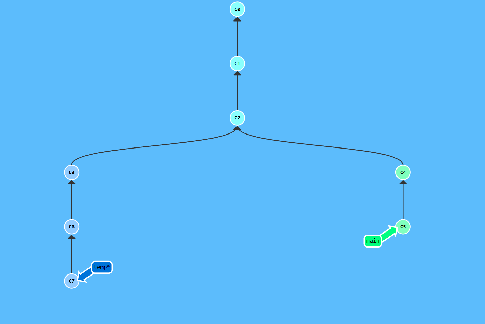
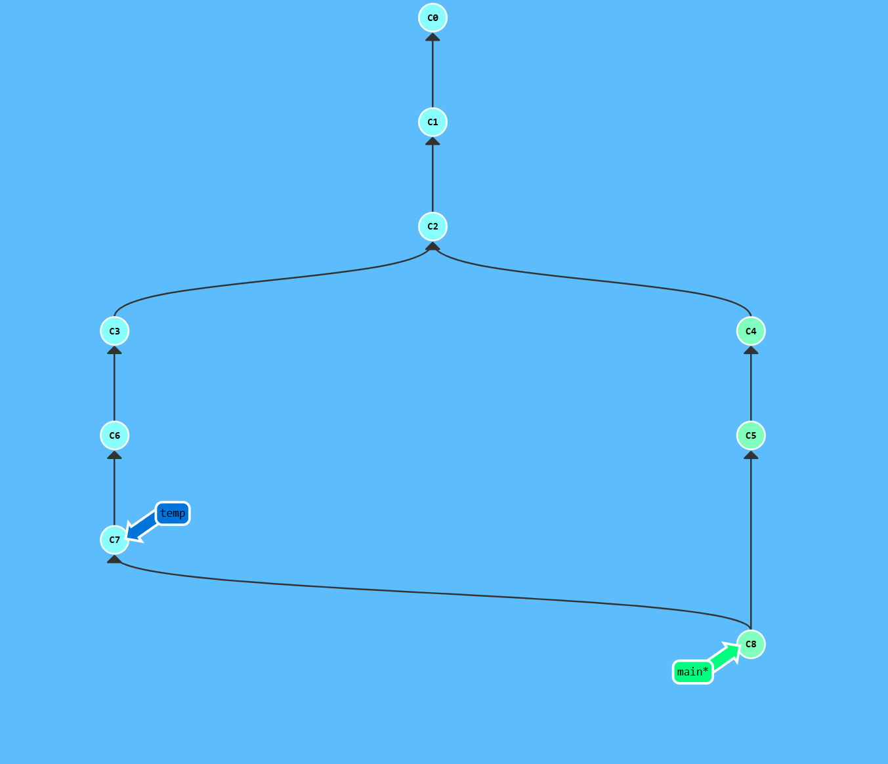

鉴于最近学习了git的命令行操作，不再依赖于图形界面，所以决定将git的常用命令记录下来，顺便给博客添加temp分支。

基础命令

初始化仓库

```bash
git init
```

添加文件, 可以一次添加一个或多个文件。
如 git add file1 file2 file3

或可以直接添加所有文件

```bash
git add .
```

提交

```bash
git commit -m "message"
```

推送

```bash
git push
```

**_注_：** 在创建了分支之后，语法会有所变化

创建gitignore文件
创建.gitignore文件，并添加需要忽略的文件。

例如

```bash
public/
resources/
.hugo_build.lock
.DS_Store
node_modules/
```

在里面添加需要忽略的文件即可自动忽略添加。

创建分支

```bash
git switch -c [分支名]
```

例如
创建分支temp

```bash
git switch -c temp
```

删除分支

```bash
git branch -d [分支名]
```

切换分支

```bash
git switch [分支名]
```

拉取分支

```bash
git pull origin [分支名]
```

推送分支

```bash
git push origin [分支名]
```

合并分支

1. 切换到目标分支

```bash
git switch [目标分支名]
```

2. 合并源分支

```bash
git merge [源分支名]
```

或

```bash
git rebase [源分支名]
```

merge和rebase的区别
merge：合并两个分支，合并后的结果会生成一个新的commit，并生成一个新的分支。
rebase：将源分支的commit合并到目标分支，并生成一个新的commit。

merge 是非线性的，rebase 是线性的。

图解二者区别



merge 后的树状图



rebase 后的树状图


