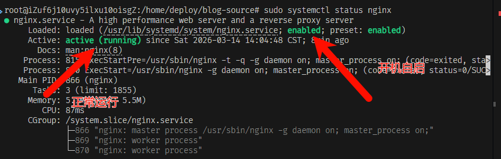
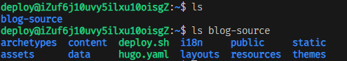
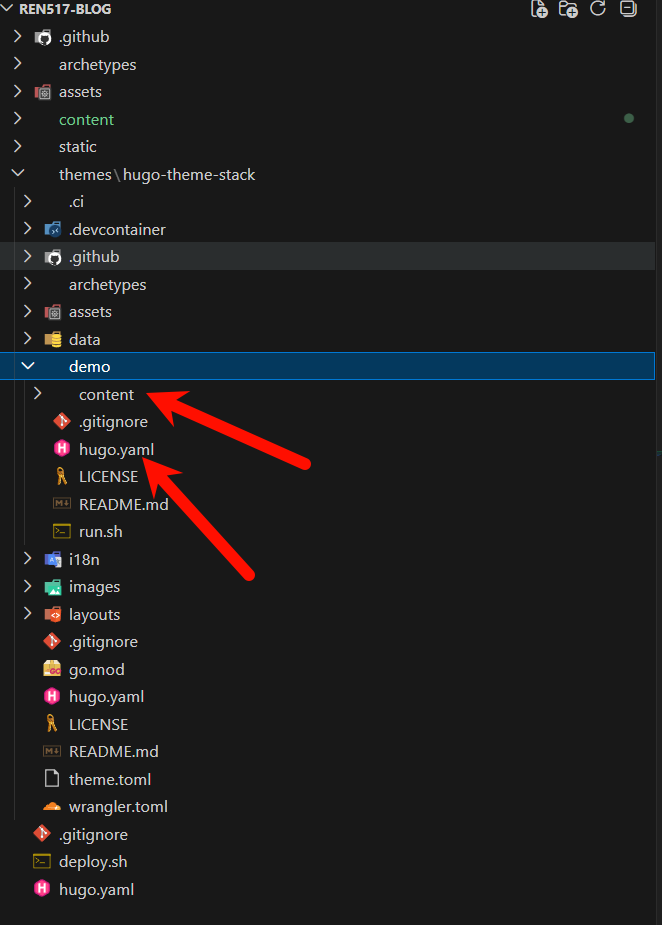
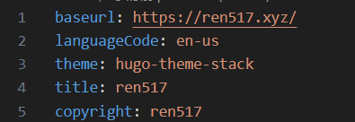
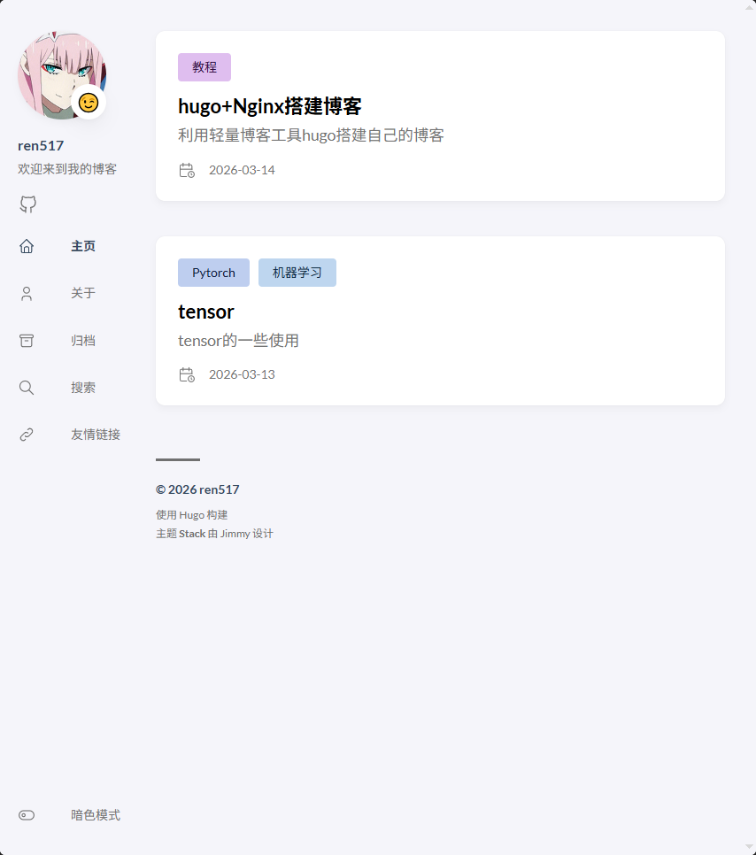
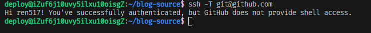
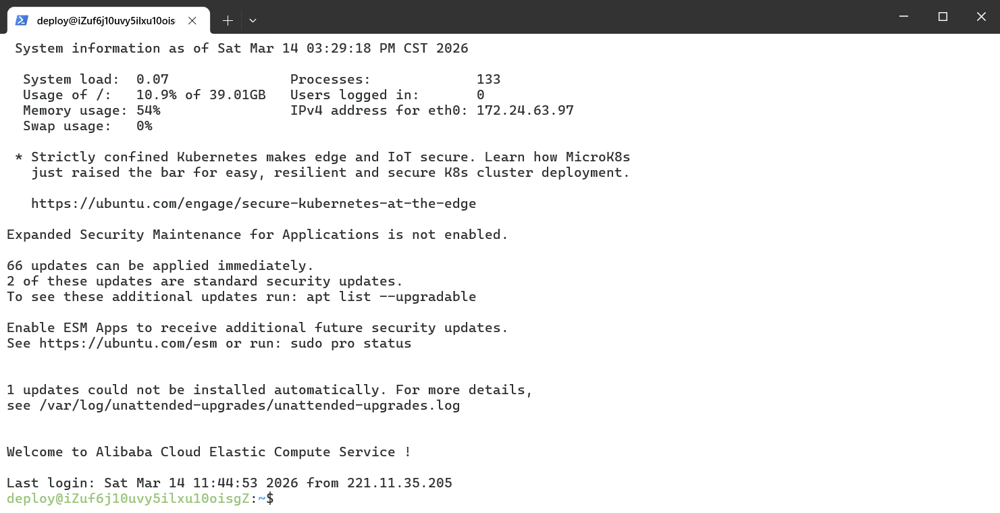
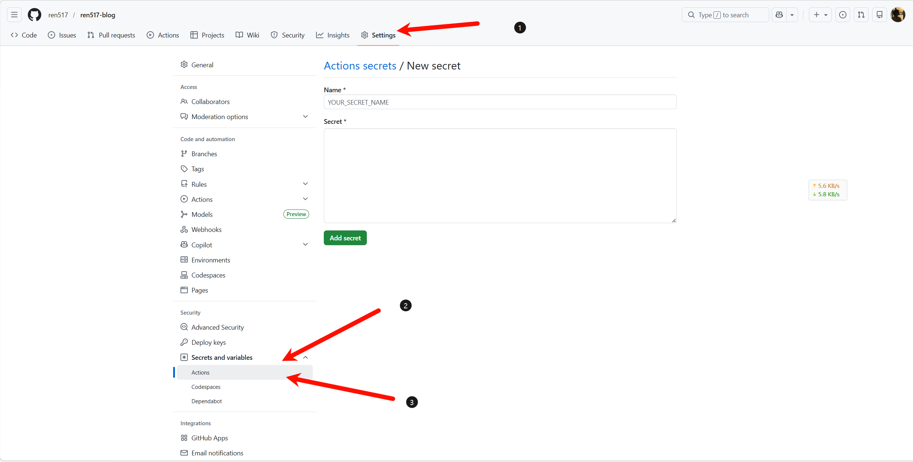

+++
author = "ren517"
title = "从零开始搭建hugo+Nginx搭建博客"
date = "2026-03-14"
description = "利用轻量博客工具hugo搭建自己的博客"
tags = [
    "hugo",
    "Nginx",
]
categories = [
    "教程",
]
series = ["Themes Guide"]
image = "images/image.png" 
+++  

本文将介绍在本地搭建 Hugo 并通过Nginx 和 服务器部署 Hugo 的方法。以下所叙之方法就是我在部署本站点时所使用的，防止自己以后忘记。如果对您有借鉴作用，或有问题欢迎留言。

---
在部署 Hugo 之前，需要进行的准备：  
1.购买一个服务器（可以看看阿里云，腾讯云的学生优惠）  
2.租一个域名  
3.下载一个文本编辑器，方便后续写md文件，推荐：vscode  
自动化脚本

### 安装Nginx
```bash
sudo apt update
sudo apt install nginx -y
```
检查是否正常运行
```bash
sudo systemctl status nginx
```

设置开机自启
```bash
sudo systemctl enable nginx
```
---
  


查看是否成功
```bash
sudo systemctl status nginx
```
如果遇到Nginx启动问题
```bash
sudo systemctl start nginx # 启动
sudo systemctl reload nginx # 重启
```

### 创建博客发布根目录
```bash
# 创建网站根目录
sudo mkdir -p /var/www/blog

# 创建 deploy 用户专门用于部署
sudo adduser deploy
sudo usermod -aG sudo deploy

# 让 deploy 用户拥有网站目录权限
sudo chown -R deploy:deploy /var/www/blog
```

### 安装Hugo
先切换到deploy用户身份
```bash
su deploy
sudo apt install hugo -y  # 安装 Hugo Extended
```
初始化博客
```bash
su - deploy
hugo new site ~/blog-source
cd ~/blog-source
```
完成后会出现以下文件  
---
  
deploy 用户将来用来自动部署 Hugo 生成的文件。

运行
```bash
hugo server -D
```
可以查看静态网页，地址通常是 localhost:1313 。如果页面显示“Page not found”，说明此前的所有配置都是正常无误的。

### 配置主题
Hugo 默认是没有主题的，需要到 [官网](https://themes.gohugo.io/) 去下载主题。我使用的主题是 Jimmy Cai 创作的 Stack 主题。接下来的部分内容会以此主题为例。
将主题下载完成后并解压至 themes 文件夹中，将demo 文件夹中的 content 和hugo.yaml 复制到主文件夹中，并删掉原来的 hugo.toml 和 Content/post/rich-content ，避免出现不兼容的错误。
**注：下载下来的主题会带版本号，如我的是hugo-theme-stack-3.34.2，删除版本号，只留下hugo-theme-stack**  
---
  

修改 hugo.yaml 中的 theme 选项，将其修改为与主题文件夹同名。  
---
  

再次在命令行输入 `hugo server-D` 启动服务，若此时能看见类似下图的样式，说明此前操作无误。  
---
  
看到类似的效果就可以了，我这个是后面还改了一些配置

在 config.yaml 中输入相关配置。文件各项配置解释如下，用作参考：

```YAML
baseurl: https://example.com  # 网站的基本 URL 。替换为你自己的网站域名。
languageCode: en-us  # 网站的默认语言代码，zh-cn 指中文简体。
theme: hugo-theme-stack  # 使用的 Hugo 主题，这里是 Stack 主题。
paginate: 3  # 每页显示的内容数量，通常用于分页设置。
title: Example Site  # 网站的标题，会显示在浏览器标签上。
copyright: Example Person  # 网站的版权信息，通常显示在页面底部。

# Theme i18n support
# Available values: ar, bn, ca, de, el, en, es, fr, hu, id, it, ja, ko, nl, pt-br, th, uk, zh-cn, zh-hk, zh-tw
DefaultContentLanguage: en  # 设置网站的默认内容语言。可选值见上注释。

# Set hasCJKLanguage to true if DefaultContentLanguage is in [zh-cn ja ko]
# This will make .Summary and .WordCount behave correctly for CJK languages.
hasCJKLanguage: false  # 如果默认语言是中文、日文或韩文，设置为 true 以确保摘要和字数统计正确。

languages:
    en:
        languageName: English  # 英语语言配置
        title: Example Site  # 英文站点标题
        weight: 1  # 语言权重，数值越小排序越靠前
        params:
            description: Example description  # 英文站点描述
    zh-cn:
        languageName: 中文  # 中文语言配置
        title: 演示站点  # 中文站点标题
        weight: 2  # 中文站点语言权重
        params:
            description: 演示说明  # 中文站点描述
    ar:
        languageName: عربي  # 阿拉伯语配置
        languagedirection: rtl  # 文字方向，从右到左
        title: موقع تجريبي  # 阿拉伯语站点标题
        weight: 3  # 阿拉伯语站点语言权重
        params:
            description: وصف تجريبي  # 阿拉伯语站点描述

services:
    # Change it to your Disqus shortname before using
    disqus:
        shortname: "hugo-theme-stack"  # Disqus 评论系统的短名称，需替换为你自己的 Disqus 短名称。
    # GA Tracking ID
    googleAnalytics:
        id:  # Google Analytics 追踪 ID，用于网站流量统计。

permalinks:
    post: /p/:slug/  # 博客文章的永久链接格式，使用文章的 slug 作为路径。
    page: /:slug/  # 页面内容的永久链接格式。

params:
    mainSections:
        - post  # 主内容区域，显示文章内容。
    featuredImageField: image  # 特色图片字段的名称。
    rssFullContent: true  # RSS 提要是否包含全文内容。
    favicon: # e.g.: favicon placed in `static/favicon.ico` of your site folder, then set this field to `/favicon.ico` (`/` is necessary)
        # 网站的favicon路径，例如`/favicon.ico`。

    footer:
        since: 2020  # 网站创建年份，通常显示在页脚。
        customText:  # 自定义页脚文本。

    dateFormat:
        published: Jan 02, 2006  # 发布日期格式。
        lastUpdated: Jan 02, 2006 15:04 MST  # 最后更新日期格式。

    sidebar:
        emoji: 🍥  # 侧边栏标题旁显示的 emoji。
        subtitle: Lorem ipsum dolor sit amet, consectetur adipiscing elit.  # 侧边栏的副标题。
        avatar:
            enabled: true  # 是否启用头像显示。
            local: true  # 是否使用本地头像。
            src: img/avatar.png  # 头像图片路径。

    article:
        math: false  # 是否支持数学公式渲染。
        toc: true  # 是否显示文章目录。
        readingTime: true  # 是否显示预计阅读时间。
        license:
            enabled: true  # 是否启用文章版权信息。
            default: Licensed under CC BY-NC-SA 4.0  # 默认版权协议。

    comments:
        enabled: true  # 是否启用评论功能。
        provider: disqus  # 选择的评论提供商，默认为 Disqus。

        disqusjs:
            shortname:  # DisqusJS 的短名称。
            apiUrl:  # DisqusJS 的 API URL。
            apiKey:  # DisqusJS 的 API Key。
            admin:  # DisqusJS 的管理员用户名。
            adminLabel:  # DisqusJS 管理员标签。

        utterances:
            repo:  # Utterances 评论系统的 GitHub 仓库地址。
            issueTerm: pathname  # Utterances 评论系统的议题关联方式，使用页面路径。
            label:  # Utterances 评论系统的标签。

        beaudar:
            repo:  # Beaudar 评论系统的 GitHub 仓库地址。
            issueTerm: pathname  # Beaudar 评论系统的议题关联方式。
            label:  # Beaudar 评论系统的标签。
            theme:  # Beaudar 评论系统的主题。

        remark42:
            host:  # Remark42 的主机地址。
            site:  # Remark42 的站点标识符。
            locale:  # Remark42 的语言设置。

        vssue:
            platform:  # Vssue 使用的平台（例如 GitHub）。
            owner:  # Vssue 评论仓库的所有者。
            repo:  # Vssue 评论的 GitHub 仓库地址。
            clientId:  # Vssue 的 OAuth 应用 Client ID。
            clientSecret:  # Vssue 的 OAuth 应用 Client Secret。
            autoCreateIssue: false  # 是否自动创建评论议题。

        waline:
            serverURL:  # Waline 评论系统的服务器 URL。
            lang:  # Waline 的语言设置。
            pageview:  # 是否启用页面浏览统计。
            emoji:  # Waline 的 Emoji 表情包地址。
                - https://unpkg.com/@waline/emojis@1.0.1/weibo
            requiredMeta:
                - name  # 评论时需要填写的字段，用户名。
                - email  # 评论时需要填写的字段，电子邮件地址。
                - url  # 评论时需要填写的字段，网址。
            locale:
                admin: Admin  # Waline 评论系统的管理员名称。
                placeholder:  # Waline 评论框的占位符文本。

        twikoo:
            envId:  # Twikoo 评论系统的环境 ID。
            region:  # Twikoo 评论系统的部署区域。
            path:  # Twikoo 评论系统的路径。
            lang:  # Twikoo 评论系统的语言设置。

        cactus:
            defaultHomeserverUrl: "https://matrix.cactus.chat:8448"  # Cactus.Chat 的默认主服务器 URL。
            serverName: "cactus.chat"  # Cactus.Chat 的服务器名称。
            siteName: "" # You must insert a unique identifier here matching the one you registered (See https://cactus.chat/docs/getting-started/quick-start/#register-your-site)
            # Cactus.Chat 的站点名称，需与注册的标识符匹配。

        giscus:
            repo:  # Giscus 评论系统的 GitHub 仓库地址。
            repoID:  # Giscus 仓库的唯一标识符。
            category:  # Giscus 的分类名称。
            categoryID:  # Giscus 分类的唯一标识符。
            mapping:  # Giscus 的议题关联方式。
            lightTheme:  # Giscus 的浅色主题设置。
            darkTheme:  # Giscus 的深色主题设置。
            reactionsEnabled: 1  # 是否启用 Giscus 的反应功能。
            emitMetadata: 0  # 是否启用 Giscus 的元数据发射功能。

        gitalk:
            owner:  # Gitalk 评论系统的仓库所有者。
            admin:  # Gitalk 评论系统的管理员用户名。
            repo:  # Gitalk 评论的 GitHub 仓库地址。
            clientID:  # Gitalk 的 OAuth 应用 Client ID。
            clientSecret:  # Gitalk 的 OAuth 应用 Client Secret。

        cusdis:
            host:  # Cusdis 评论系统的主机地址。
            id:  # Cusdis 的站点标识符。
    widgets:
        homepage:
            - type: search  # 首页的小部件，搜索功能。
            - type: archives  # 首页的小部件，文章归档。
              params:
                  limit: 5  # 显示的归档文章数量。
            - type: categories  # 首页的小部件，文章分类。
              params:
                  limit: 10  # 显示的分类数量。
            - type: tag-cloud  # 首页的小部件，标签云。
              params:
                  limit: 10  # 显示的标签数量。
        page:
            - type: toc  # 页面的小部件，显示文章目录。

    opengraph:
        twitter:
            # Your Twitter username
            site:  # 你的 Twitter 用户名，将在 OpenGraph 元数据中使用。
            # Available values: summary, summary_large_image
            card: summary_large_image  # Twitter 卡片类型。可以选择 `summary` 或 `summary_large_image`，后者显示大图。

    defaultImage:
        opengraph:
            enabled: false  # 是否为没有特色图片的页面启用默认 OpenGraph 图片。
            local: false  # 是否使用本地图片作为 OpenGraph 图片。
            src:  # 默认 OpenGraph 图片的路径。

    colorScheme:
        # Display toggle
        toggle: true  # 是否在页面上显示颜色模式切换按钮。

        # Available values: auto, light, dark
        default: auto  # 默认的颜色模式。可以选择自动切换（auto），或固定为亮色（light）或暗色（dark）。

    imageProcessing:
        cover:
            enabled: true  # 是否为封面图片启用自动处理功能，例如裁剪、缩放等。
        content:
            enabled: true  # 是否为内容图片启用自动处理功能。

### Custom menu
### See https://stack.jimmycai.com/config/menu
### To remove about, archive and search page menu item, remove `menu` field from their FrontMatter
menu:
    main: []  # 自定义主菜单的配置，可以在这里添加导航链接。

    social:
        - identifier: GitHub  # 社交链接的标识符，通常用于指定图标。
          name: GitHub  # 链接的显示名称。
          url: https://GitHub.com/CaiJimmy/hugo-theme-stack  # GitHub 个人主页的链接。
          params:
              icon: brand-GitHub  # 使用的社交图标，这里是 GitHub 图标。

        - identifier: twitter  # 另一个社交链接配置，这里是 Twitter。
          name: Twitter  # Twitter 链接的显示名称。
          url: https://twitter.com  # Twitter 的链接。
          params:
              icon: brand-twitter  # 使用的社交图标，这里是 Twitter 图标。

related:
    includeNewer: true  # 是否在相关文章中包含较新的文章。
    threshold: 60  # 相关文章匹配的相似度阈值，范围是0到100。
    toLower: false  # 是否将标签和分类转换为小写。
    indices:
        - name: tags  # 使用标签作为相关文章的匹配依据。
          weight: 100  # 标签匹配的权重值。
        - name: categories  # 使用分类作为相关文章的匹配依据。
          weight: 200  # 分类匹配的权重值。

markup:
    goldmark:
        renderer:
            ## Set to true if you have HTML content inside Markdown
            unsafe: true  # 如果 Markdown 中包含 HTML 内容，设置为 true 以允许渲染这些 HTML。

    tableOfContents:
        endLevel: 4  # 目录生成时的最大标题级别。
        ordered: true  # 目录项是否使用有序列表。
        startLevel: 2  # 目录生成时的起始标题级别。

    highlight:
        noClasses: false  # 语法高亮时是否禁用 CSS 类名。
        codeFences: true  # 是否启用代码块语法高亮。
        guessSyntax: true  # 是否自动猜测代码块的语言进行语法高亮。
        lineNoStart: 1  # 代码行号的起始值。
        lineNos: true  # 是否在代码块中显示行号。
        lineNumbersInTable: true  # 是否在表格样式中显示行号。
        tabWidth: 4  # 代码块中 Tab 的宽度（空格数）。

```
更多相关配置参见[官网](更多相关配置参见官网，例如网站字体配置、自定义页眉或页脚等。)，例如网站字体配置、自定义页眉或页脚等。

### 撰写文章
在 你的站点名称/content/post 文件夹下新建文件夹，在新建文件夹中创建 index.md 文件，就代表创建一篇新文章了。
之后通过 VS Code 或其他编辑器，用 markdown 语言写文章。
在使用 hugo 命令生成的文章的最上面，都有一块被 +++ 或 --- 包裹出来的区域，它的官方名称是 “Front matter”， 用以指定文章的各项属性。下面是我在 stack 主题的一篇示例文章中摘取的 Front Matter 片段，并写出了注释：
```markdown
+++
author = "Hugo Authors"  # 作者名称，用于标识文章的创作者。
title = "Markdown Syntax Guide"  # 文章标题，将显示在页面和导航中。
date = "2019-03-11"  # 文章的发布日期，用于排序和展示。
description = "Sample article showcasing basic Markdown syntax and formatting for HTML elements."  # 文章的简短描述，通常用于摘要或 SEO。
tags = [
    "markdown",  # 文章的标签，用于分类和搜索。标签是灵活的，可以添加多个。
    "css",
    "html",
    "themes",
]
categories = [
    "themes",  # 文章的类别，用于组织和过滤内容。每篇文章可以属于一个或多个类别。
    "syntax",
]
series = ["Themes Guide"]  # 文章系列，通常用于将相关文章组织在一起，例如教程或主题指南系列。
aliases = ["migrate-from-jekyl"]  # 别名，用于创建文章的旧路径重定向到新路径。例如，当迁移文章时使用。
image = "pawel-czerwinski-8uZPynIu-rQ-unsplash.jpg"  # 文章的封面图片路径，用于展示文章时的视觉效果。
+++
```
#### 常用的Front Matter字段
- title ：文章标题。自动生成的标题与文件名保持一致。
- date：文章创建日期。默认生成的日期为文件创建时的日期。
- lastmod：文章最后更新日期。
- description：文章简要描述，用于摘要或 SEO 优化。
- categories：文章分类。
- tags：文章标签。
- image：封面图片。
- draft：是否为草稿。如果设置为 true，Hugo 将不会编译该文件，文章也不会在页面中显示。
- hidden：是否隐藏文章。与 draft 的区别在于，设置为 true 的文章仍然存在，只是不会在页面中显示，但可以通过正确的网址访问。

### 配置 Nginx 发布 Hugo
配置 Nginx 发布 Hugo
```bash
sudo nano /etc/nginx/sites-available/blog
```
不过我感觉nano并不好用，如果你用vscode连接远程服务器，可以用下面命令
```
code /etc/nginx/sites-available/blog
```
下面内容里我都会用vscode编辑文件
示例内容
```nginx
server {
    listen 80;
    server_name ren517.xyz www.ren517.xyz; # 改成你的域名

    root /var/www/blog;
    index index.html;

    location / {
        try_files $uri $uri/ /index.html;
    }
}
```
启用并重启Nginx
```bash
sudo ln -s /etc/nginx/sites-available/blog /etc/nginx/sites-enabled/
sudo nginx -t
sudo systemctl reload nginx
```
现在 Hugo 构建后的 public/ 目录内容将发布到 /var/www/blog。
```bash
#!/bin/bash
cd /home/deploy/blog-source
hugo --minify
rsync -av --delete public/ /var/www/blog/
sudo systemctl reload nginx
```
现在打开你的域名，已经部署成功了。
接下来我会讲一些自动化的内容，如果不需要到这一步就可以结束了。
后面每一次添加了文件，只需要把上面命令跑一遍即可

### 部署脚本
在 `/home/deploy/blog-source/` 创建：deploy.sh文件
里面添加以下内容
```bash
cd /home/deploy/blog-source
hugo --minify
rsync -av --delete public/ /var/www/blog/
sudo systemctl reload nginx
```
给脚本权限：
```bash
chmod +x deploy.sh
```
到这一步就不需要上面每次都敲命令行了
直接 `./deploy.sh` 就自动执行上面四条命令了

### 发布到GitHub
在GitHub上面创建仓库Blog(不要勾选README)，复制SSH链接
在服务器上初始化并完成一些配置：
```bash
git config --global user.name "Ren517"
git config --global user.email "你的邮箱"

git config --global init.defaultBranch main # 默认主分支叫 main
git config --global pull.rebase false # 避免 pull 警告

git config --global core.editor nano
```
在服务器上创建key：
```bash
ssh-keygen -t ed25519 -C "blog-deploy"
```
然后一路回车到底
会生成两个文件
```     
~/.ssh/id_ed25519
~/.ssh/id_ed25519.pub
```
查看公钥
```bash
cat ~/.ssh/id_ed25519.pub
```
复制整行，类似`ssh-ed25519 AAAAC3NzaC1lZDI1NTE5AAAAI....... blog-deploy`
然后：
GitHub仓库 → Settings → Deploy keys → Add deploy key
添加公钥

测试
```
ssh -T git@github.com
```
可以看到  
---
  

#### 第一次提交
```bash
git init
git branch -M main
```
创建 .gitignore
```bash
code .gitignore
```
写入
```
public/
resources/
node_modules/
.DS_Store
.hugo_build.lock
```
解释
| 目录               | 原因              |
| ---------------- | --------------- |
| public           | build产物，不需要版本管理 |
| resources        | Hugo缓存          |
| node_modules     | npm依赖           |
| .hugo_build.lock | 构建锁文件           |

```bash
git add .
git commit -m "Initial commit: Hugo blog setup"
```
连接仓库推送
```bash
git remote add origin git@github.com:ren517/ren517-blog.git
```
```bash
git push -u origin main
```
看到
```bash
main -> main
branch 'main' set up to track 'origin/main'
```
就代表成功了
### SSH配置
1.切换到deploy用户
```bash
su - deploy
ssh-keygen -t ed25519 -C "github-actions-deploy"
```
2.将公钥加入 authorized_keys，允许免密 SSH：
```bash
cat ~/.ssh/id_ed25519.pub >> ~/.ssh/authorized_keys
chmod 600 ~/.ssh/authorized_keys
chmod 700 ~/.ssh
```
```bash
ls ~/.ssh
```
输出
```bash
deploy@iZuf6j10uvy5ilxu10oisgZ:~/blog-source$ ls ~/.ssh
authorized_keys  id_ed25519  id_ed25519.pub  known_hosts  known_hosts.old
```
把id_ed25519下载，移动到C:\Users\用户名字\.ssh目录中
打开终端，测试免密登录
```bash
ssh -i ~/.ssh/id_ed25519 deploy@139.196.39.87 # 换成你的服务器公共ip
```
---
  
这样即为成功

### 更改部署脚本
打开deploy.sh文件，修改成以下内容
```bash
#!/bin/bash

# 切到源码目录
cd /home/deploy/blog-source

# 拉取最新代码
git pull origin main

# 构建 Hugo
hugo --minify

# 同步到 Nginx发布目录
rsync -av --delete public/ /var/www/blog/

# 重新加载 Nginx
sudo systemctl reload nginx
```
给脚本加权限
```bash
chmod +x deploy.sh
```
### GitHub Actions 自动部署
---
  
| Name *           | Secret *                         |
| -------------- | -------------------------- |
| SERVER_HOST    | 服务器 IP                     |
| SERVER_USER    | deploy                     |
| SERVER_SSH_KEY | deploy 用户私钥（id_ed25519 内容） |
分为三个秘密，分别添加
创建 workflow 文件 .github/workflows/deploy.yml：
内容
```YAML
name: Deploy Hugo Blog

on:
  push:
    branches:
      - main

jobs:
  build-and-deploy:
    runs-on: ubuntu-latest

    steps:
      - name: Checkout code
        uses: actions/checkout@v3

      - name: Setup Hugo
        uses: peaceiris/actions-hugo@v3
        with:
          hugo-version: '0.157.0'

      - name: Build Hugo
        run: hugo --minify

      - name: Deploy to Server
        uses: appleboy/ssh-action@v0.1.6
        with:
          host: ${{ secrets.SERVER_HOST }}
          username: ${{ secrets.SERVER_USER }}
          key: ${{ secrets.SERVER_SSH_KEY }}
          port: 22
          script: |
            cd /home/deploy/blog-source
            git pull origin main
            hugo --minify
            rsync -av --delete public/ /var/www/blog/
            sudo systemctl reload nginx
```
提交workflow
```bash
git add .github/workflows/deploy.yml
git commit -m "Add GitHub Actions auto-deploy workflow"
git push origin main
```
---
到这里就大功告成了
以后只需要
```bash
git add .
git commit -m "写文章或修改博客"
git push
```
不需要再登入自己的服务器，就可以更改内容了
如果action挂了，手动紧急部署
```bash
cd ~/blog-source
./deploy.sh
```

---
二更
发现了图片渲染的问题，如果直接用markdown语法
```md

```
如果图片上面没有标题或代码块，会导致渲染问题
解决方案
```md
---

```
加上一条分割线，成功解决