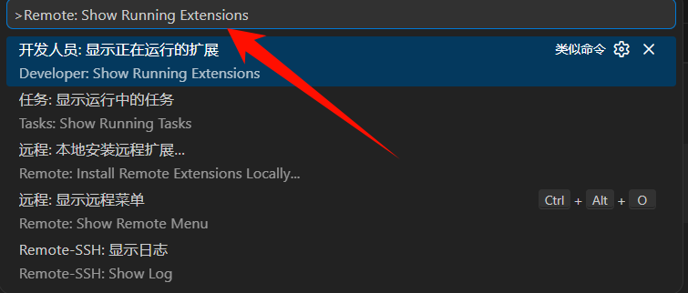
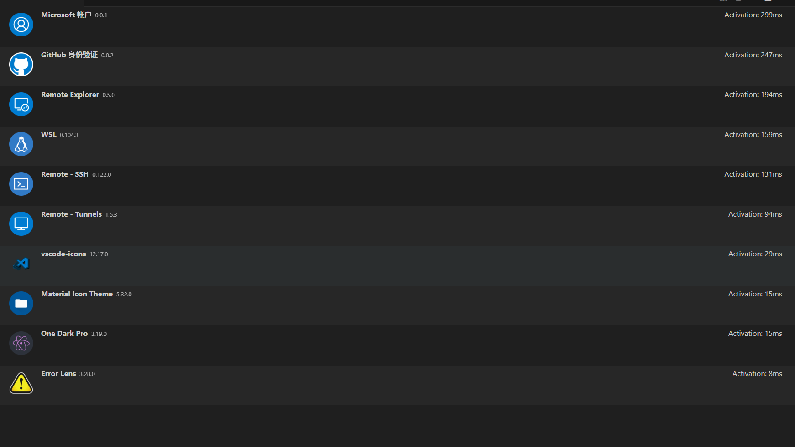

+++
author = "ren517"
title = "优化服务器内存"
date = "2026-03-14"
description = "解决vscode远程连接服务器，导致服务器占用内存过高的问题"
tags = [
    "hugo",
    "Nginx",
]
categories = [
    "教程",
]
series = ["Themes Guide"]
+++  
### 问题
由于我是一个2g内存的轻量服务器，经常才刚刚连上服务器，导致内存占用过高，经常时服务器崩溃
---
### 减少不必要的插件
删除类似
```
Python
Pylance
ESLint
Docker
GitLens
Jupyter
Copilot
C++
Java
```
这些不必要的插件
只留下如：git, ssh, 等基础插件，占用内存较小
#### 查看当前运行的所有插件
```
ctrl + shift + p
向里输入Remote: Show Running Extensions
```

---


### 设置vscode插件
在本地 VSCode：
打开：
```
settings.json
```
加入：
```json
"remote.extensionKind": {
    "ms-python.python": ["ui"],
    "ms-toolsai.jupyter": ["ui"],
    "ms-vscode.cpptools": ["ui"]
}
```
优化前
```bash
deploy@iZuf6j10uvy5ilxu10oisgZ:~/blog-source$ free -h
               total        used        free      shared  buff/cache   available
Mem:           1.6Gi        1.0Gi       134Mi       2.6Mi       622Mi      604Mi
Swap:             0B          0B          0B
```
优化后
```bash
deploy@iZuf6j10uvy5ilxu10oisgZ:~/blog-source$ free -h
               total        used        free      shared  buff/cache   available
Mem:           1.6Gi       572Mi       708Mi       2.8Mi       485Mi       1.0Gi
Swap:             0B          0B          0B
```
可以说是显著优化了

### 更保险的加入swap
由于我服务器内存太小了，防止爆掉，加入2g的swap内存,类似Windows的虚拟内存，把硬盘暂时当内存使用

只需要两步
```bash
sudo fallocate -l 2G /swapfile
sudo chmod 600 /swapfile
sudo mkswap /swapfile
sudo swapon /swapfile
```
使swap永久生效：
```bash
echo '/swapfile none swap sw 0 0' | sudo tee -a /etc/fstab
```
```bash
deploy@iZuf6j10uvy5ilxu10oisgZ:~/blog-source$ free -h
               total        used        free      shared  buff/cache   available
Mem:           1.6Gi       591Mi       685Mi       2.8Mi       490Mi       1.0Gi
Swap:          2.0Gi          0B       2.0Gi
```
#### 还可以再做一个优化
调整 swap 使用策略：
查看：
```bash
cat /proc/sys/vm/swappiness
```
我这边是10，阿里云比较保守
```bash
0   → 几乎不用 swap
100 → 很积极用 swap
```
```
除非 RAM 完全用完
否则不用 swap
```
结果就是：内存接近满：不会提前交换然后突然OOM killer，触发直接杀进程。对远程开发来说：这是不好的。
ChatGPT给我建议修改为10
```bash
sudo sysctl vm.swappiness=10
cat /proc/sys/vm/swappiness
```
永久化
```bash
echo "vm.swappiness=10" | sudo tee -a /etc/sysctl.conf
```
应用
```bash
sudo sysctl -p
```