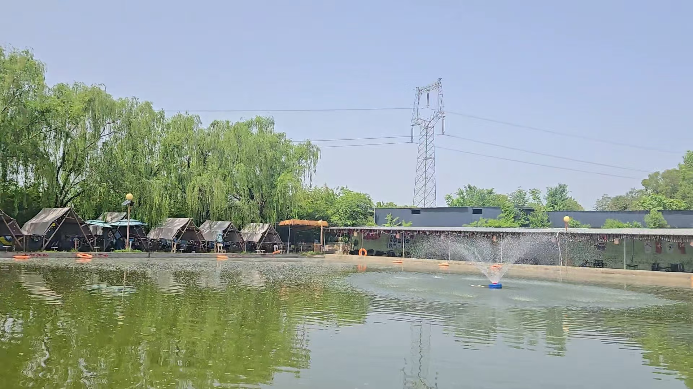
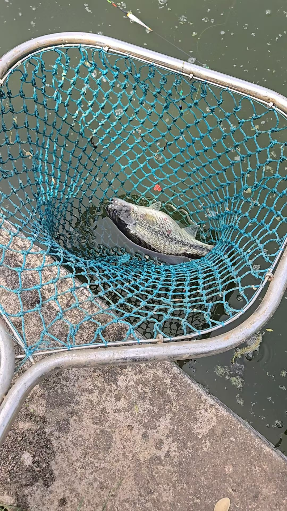
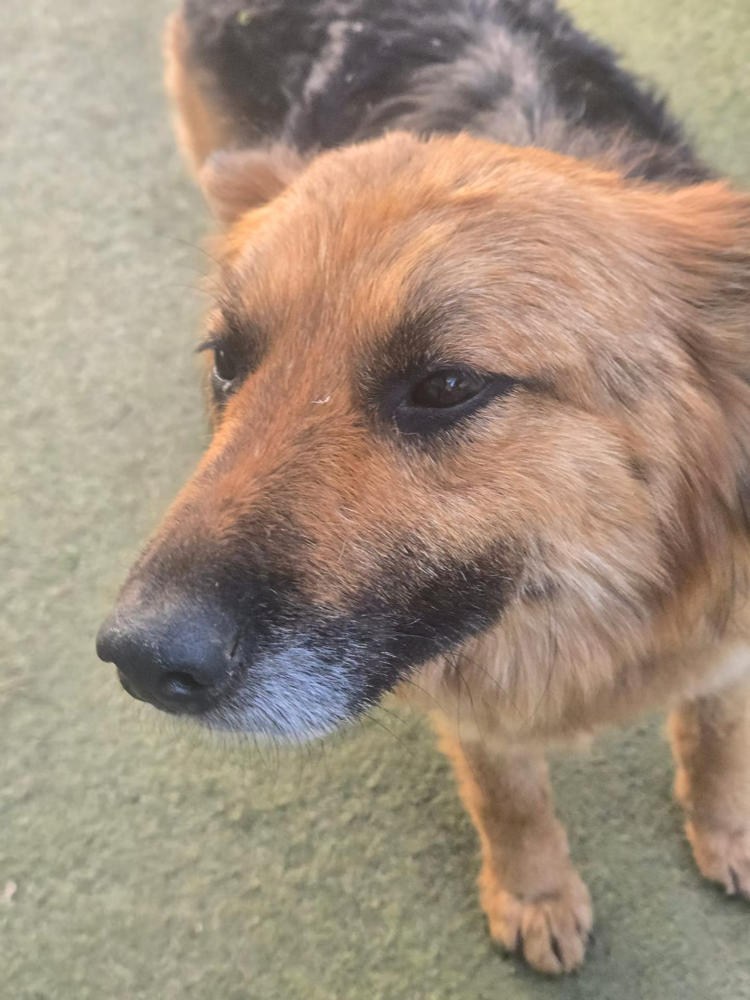
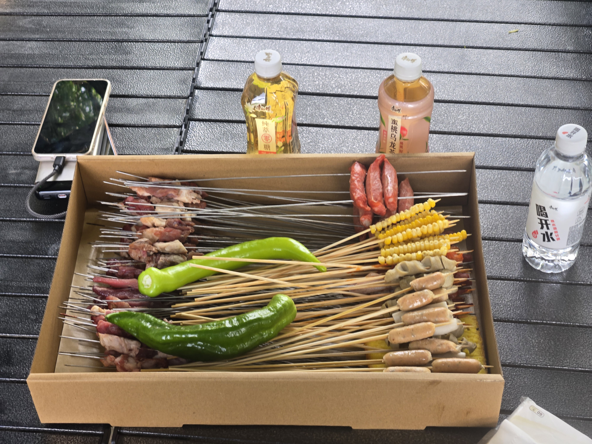
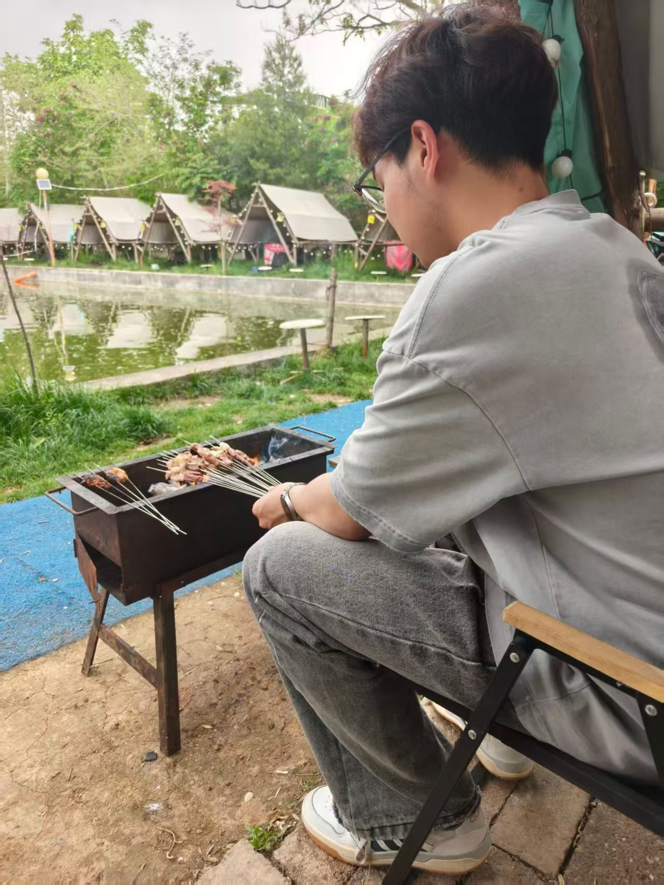
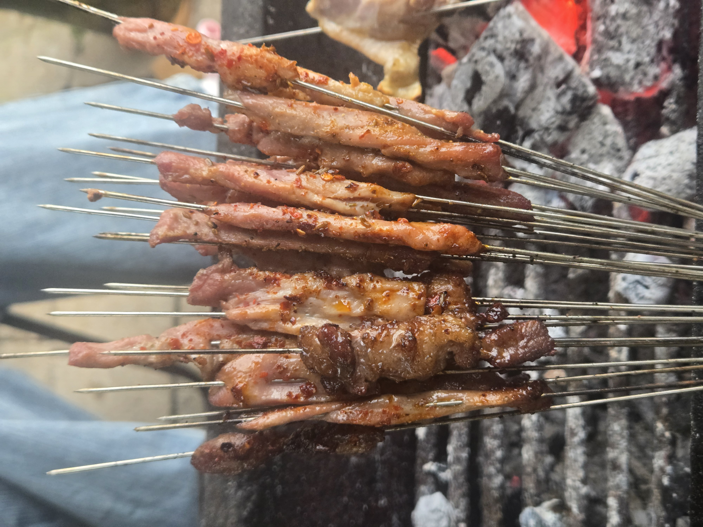
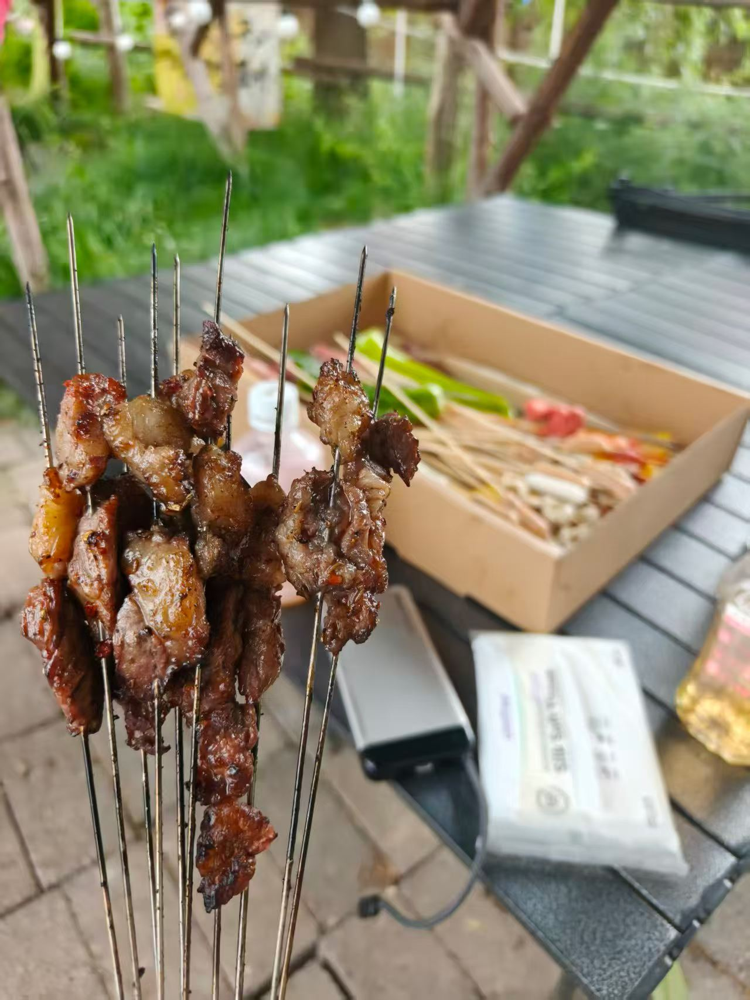
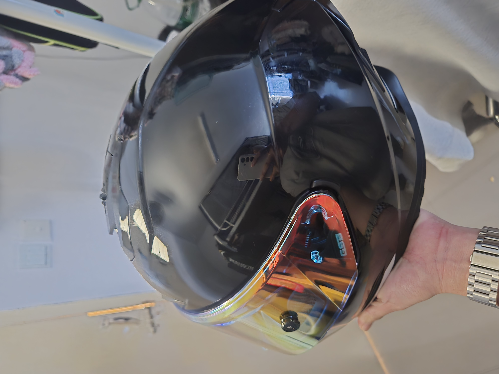
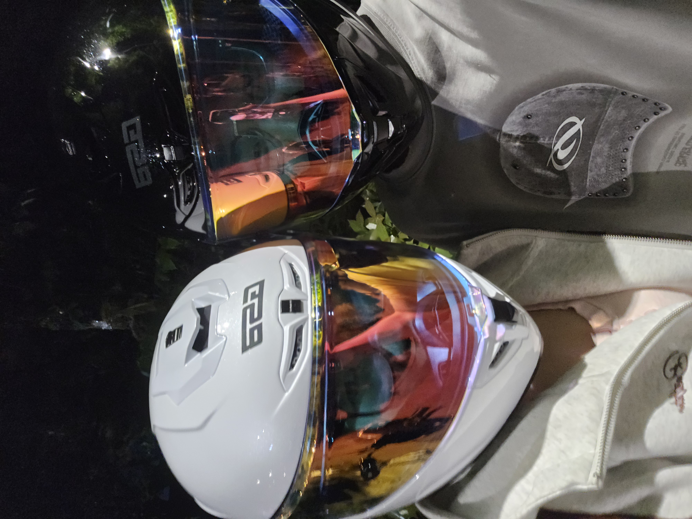

+++
author = "ren517"
title = "出去野餐玩啦！！"
date = "2026-04-26"
description = "分享一下最近的日常生活"
tags = [
    "生活",
    "美食",
]
categories = [
    "生活",
]
series = ["Themes Guide"]
+++

今天是周天，学校开了两天运动会，加上一个周末，也算是放了一个小长假。本来计划要去南昌玩的，因为身体原因就取消了计划。就当我取消了计划的时候，全世界的事情好像都给我爆发了。修改了一个PPT，完成了嵌入式的环境配置和个人作业又写了一个创新创业计划书。甚至在开幕式第一天还去代表学生会拍摄照片，经过两天的高强度任务，我决定去个农家乐玩上一天。在抖音上看到一家合适了，结果觉得这个地方很棒，超出了我的预期。

地方在哪我就不在博客里面说了，要是有西安的朋友，想知到在哪里，也想去玩，可以给我发邮箱。

先来一张全景图

山清水秀，里面很大的面积，前面是可以围炉煮茶的地方。我没有过多停留，直奔到了后面的鱼塘，现在正值好天气，也没有夏天那么热，钓鱼是非常爽的，而且里面鱼非常多，像我这样没有任何钓鱼基础的人，也在十分钟左右上了一条大鲈鱼。

而且鱼也没有咬我下的钩子，它的肚子被我钓到了，我真是新手保护期，碰到了一条笨鱼。

玩了一会感觉非常不错，突然又来了一只可爱的布鲁斯。找了一些零食给它吃，他吃的很高兴，给我们一直摇尾巴。

里面还有很多娱乐设施，从小孩玩的滑滑梯，秋千，还有台球，大草地等等等，我觉得完全是一个世外桃源可以完全的放松身心。

我最喜欢这个吊床，真想一辈子都在这里躺平

玩了一下午，肚子也饿了，准备开始烧烤。

烧烤也特别容易，我本来觉得两个人去烧烤基本就是不可能的事情，两个人太麻烦了，而且我们没有汽车，也带不了那么多东西。
但是这个农家乐里面超级方便，我只要打个空手去就完全可以了。老板会给你准备好所有需要用的，从烧烤架到煤炭，从食材到饮料，一应俱全，而且食材绝对新鲜，老板就在前台一直处理食材，现成穿烧烤串串。

这是老板给我们准备的，真是高估我们了，我们开始也是眼睛大肚子小，感觉自己能吃完，结果发现我们根本吃不完这么多。

我要开始大展我的烧烤身手了，其实我很小就会烤烧烤了，只是深藏不露而已，给对象漏了一手。

看着就很诱人吧，我去完之后就感觉这地方真是相见恨晚，以后可以和更多朋友一起去，绝对可以让每个人都开心离去。

到这里就应该结束了，可是我在这次出去发生了意外。因为春天万物竞发，生机勃勃。一路上有很多的花粉和小虫子，加上骊山这边的风特别大，导致主播回来的路上骑车根本就睁不开眼睛。回到学校直接泪眼婆娑，所以有了这个经验之后我直接入手了一顶全盔(其实也有一部分我车瘾大的原因)

期待了几天，今天头盔就到了，因为是武汉发货的，就特别快。太让我激动了，头盔很帅，下次出门就可以帅帅的骑车了。

好了就这些，其实我日常也很无聊，就是一个无聊的人给自己找一点乐子。
