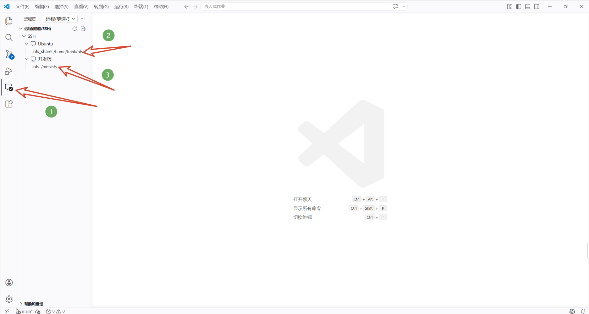
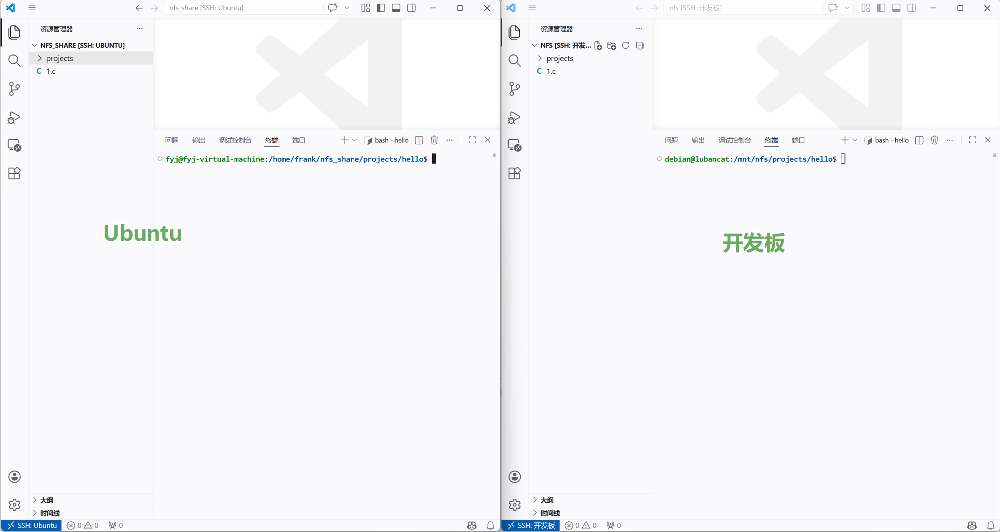

+++
author = "ren517"
title = "嵌入式完成最简单开发"
date = "2026-04-23"
description = "利用Ubuntu完成一整套开发，在开发板上运行程序"
tags = [
    "嵌入式",
]
categories = [
    "教程",
]
series = ["Themes Guide"]
+++

写一个文章，记录一下配置好环境需要的操作，完成最简单的一个软件调试。
目的：在主机Ubuntu上开发并生成可执行文件，把可执行文件传到开发板上，执行这个程序。

**Q1: 为什么不在开发板上编辑并调试**
因为在开发板上性能有限，很难自主一套完成一套任务。现在虽然开发板性能上在提升，但作为程序员角度来说，还是不够优雅。

**Q2: 为什么要用Ubuntu而不用Windows开发**
在老师发的文档中有提到
原因解释：
CPU 只能理解其原生指令集
x86_64 指令 ≠ ARM64 指令
就像让只会中文的人读英文书一样，CPU “看不懂” 错误的指令格式

### 实验条件

已经成功的让虚拟机加入桥接网卡，IP ：192.168.137.100。
ssh连接Ubuntu用的NAT模式的网卡 IP ：192.168.5.128。

在开发板上

```bash
ping 192.168.137.100
```

这样即证明虚拟机和开发板连通

```bash
debian@lubancat:/mnt/nfs$ ping 192.168.137.100
PING 192.168.137.100 (192.168.137.100) 56(84) bytes of data.
64 bytes from 192.168.137.100: icmp_seq=1 ttl=64 time=2.94 ms
64 bytes from 192.168.137.100: icmp_seq=2 ttl=64 time=2.06 ms
```

同理，在Ubuntu上

```bash
ping 192.168.137.2
```

两边都成功则肯定没有问题了

在Ubuntu上执行以下命令，检测NFS是否开启

```bash
sudo systemctl status nfs-kernel-server
```

出现绿色的
在开发板上运行active √
**_这里的日志文件，不会和之前的命令一样直接退出，若退出按ctrl+c_**

```bash
df -h | grep nfs
ls -la /mnt/nfs
```

若没有报错，且看到了Ubuntu上的共享文件，就OK

如果检测到NFS没有开启，或有其他错误，请检查上一篇野火imx8m开发板开发配置指南4.1,4.2,4.3，看看是否配置正确

开发板上的共享文件夹路径

```bash
debian@lubancat:/mnt/nfs$ pwd
/mnt/nfs
```

若想切换到这个路径，在开发板软件里面终端输入

```bash
cd /mnt/nfs
```

Ubuntu上的共享文件夹路径

```bash
fyj@fyj-virtual-machine:/home/frank/nfs_share$ pwd
/home/frank/nfs_share
```

若想切换到这个路径，在vm终端输入

```bash
cd /home/frank/nfs_share
```

### 解决方案一（文档里的默认方法）

在Ubuntu上(用vm进入)

```bash
# 若没有这个路径就自己创建一下
cd /home/frank/nfs_share/projects/hello
sudo nano main.c
```

写入代码

```c
#include <stdio.h>
int main(int argc, char *argv[]) {
    printf("Hello from i.MX8M!\n");
    return 0;
}
```

运行指令编译

```bash
aarch64-linux-gnu-gcc -static main.c -o hello
```

现在进入开发板(用ModaXterm)

```bash
# 进入 NFS 挂载点
cd /mnt/nfs/projects/hello

# 查看文件（应该能看到刚编译的 hello 程序）
ls -la hello

# 赋予执行权限
chmod +x hello

# 运行程序
./hello
```

然后就能看到结果了

```bash
debian@lubancat:/mnt/nfs/projects/hello$ ./hello
Hello from i.MX8M!
```

### 方案二(笔者更推荐的一种)

我总觉得方案一不够直观，不够方便编辑，用了nano编辑器，又不想在Ubuntu里面下载vscode
所以我用了Windows的vscode，利用了ssh(不会的可以自己去学一下，我这边已经配置好了)



这就是进来以后的界面



优势：秒更新，可视化，很清晰的看到两边的同步。傻瓜式流程，就能感觉和Windows上开发别无两样。

用法：左边是Ubuntu，在上面用ui创建文件/文件夹，右侧即可编辑
编辑好后用vscode内置终端，执行和上面相同操作即可
