+++
author = "ren517"
title = "设计模式知识点"
date = "2026-08-12"
categories = [
    "软件设计师",
]
series = ["Themes Guide"]
+++

## 设计模式知识点

### 设计模式的要素

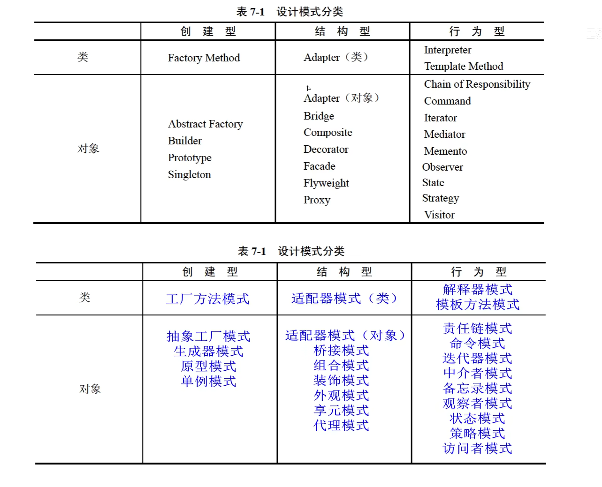

### 创建型设计模式（5种）

#### Simple Factory（简单工厂）

- 简单工厂模式属创建型模式，但不属于23种设计模式之一。
- 定义：定义一个工厂类，他可以根据参数的不同返回不同类的实例，被创建的实例通常都具有共同的父类。在简单工厂模式中用于被创建实例的方法通常为静态(static)方法，因此简单工厂模式又被成为静态工厂方法
- 简单工厂模式违反了开放封闭原则，即对扩展开放对修改也开放。

​ 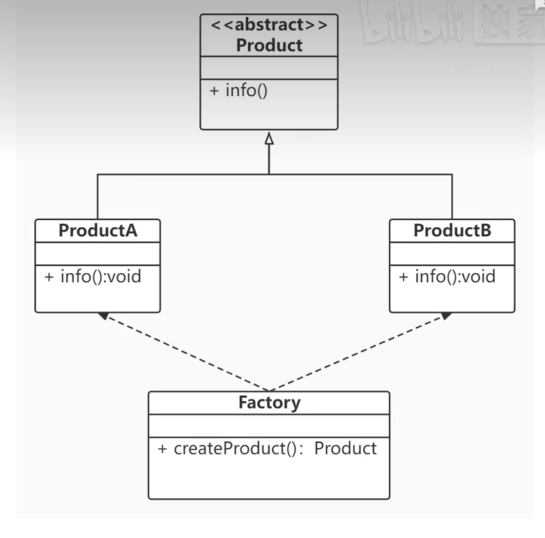

#### 1. Factory Method（工厂方法）

1）意图：定义一个用于创建对象的接口，让子类决定实例化哪一个类。**Factory Method 使一个类的实例化延迟到其子类。**

2）结构：创建型类模式 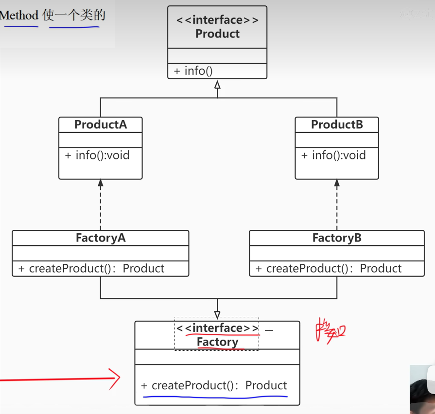

3）适用性：Factory Method 模式适用于

- 当一个类不知道它所必须创建的对象的类的时候。

- 当一个类希望由它的子类来指定它所创建的对象的时候。

- 当类将创建对象的职责委托给多个帮助子类中的某一个，并且你希望将哪一个帮助子类是代理者这一信息局部化的时候。

#### 2. Abstract Factory（抽象工厂）

1）意图

提供一个创建一系列相关或相互依赖对象的接口，而无须指定它们具体的类。

2）结构：创建型对象模式

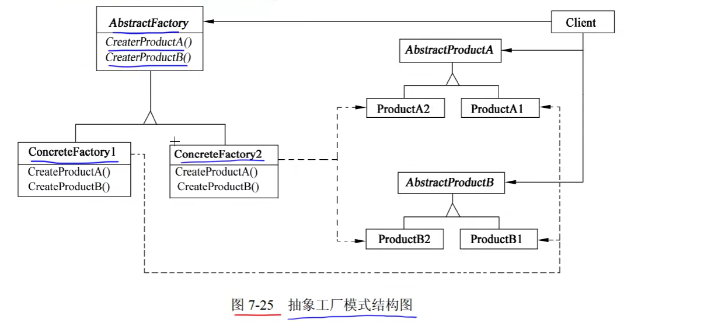

3）适用性：Abstract Factory 模式适用于

- 一个系统要独立于它的产品的创建、组合和表示时。
- 一个系统要由多个产品系列中的一个来配置时。
- 当要强调一系列相关的产品对象的设计以便进行联合使用时。
- 当提供一个产品类库，只想显示它们的接口而不是实现时。

#### 3. Builder（生成器）

1）意图

将一个复杂对象的构建与它的表示分离，使得同样的构建过程可以创建不同的表示。

2）结构：创建型对象模式

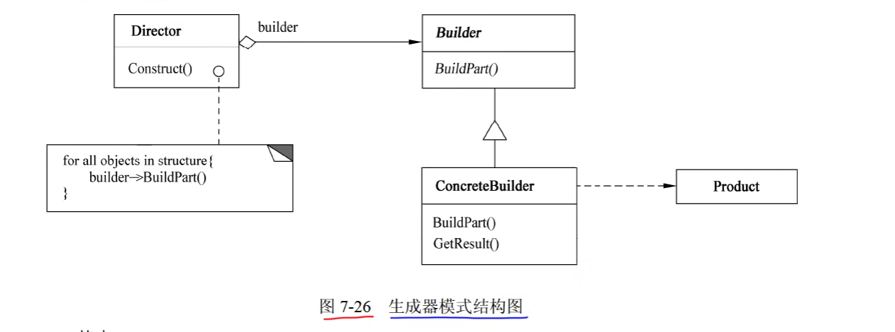

3）适用性：Builder 模式适用于

- 当创建复杂对象的算法应该独立于该对象的组成部分以及它们的装配方式时。
- 当构造过程必须允许被构造的对象有不同的表示时。

#### 4. Prototype（原型）

1）意图

用原型实例指定创建对象的种类，并且通过复制这些原型创建新的对象。

2）结构：创建型对象模式

- Prototype声明一个复制自身的接口。
- ConcretePrototype 实现一个复制自身的操作。
- Client 让一个原型复制自身从而创建一个新的对象

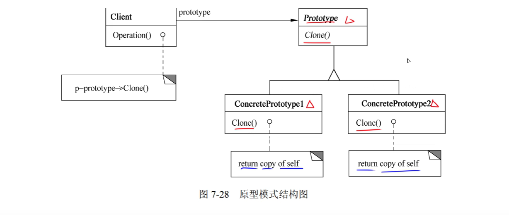

3）适用性：Prototype 模式适用于

- 当一个系统应该独立于它的产品创建、构成和表示时。
- 当要实例化的类是在运行时刻指定时，例如，通过动态装载。
- 为了避免创建一个与产品类层次平行的工厂类层次时。
- 当一个类的实例只能有几个不同状态组合中的一种时。建立相应数目的原型并克隆它们，可能比每次用合适的状态手工实例化该类更方便一些。

#### 5. Singleton（单例）

1）意图

保证一个类仅有一个实例，并提供一个访问它的全局访问点。

2）结构：创建型对象模式

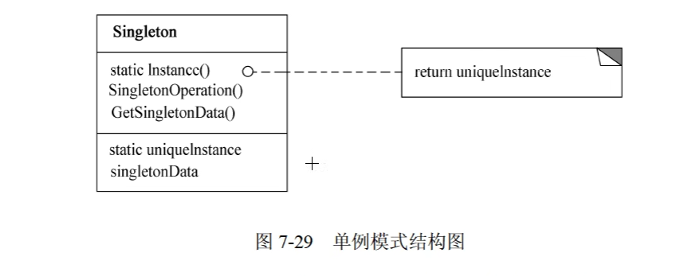

其中：Singleton指定一个Instance操作，允许客户访问它的唯一实例，Instance是一个类

3）适用性
Singleton 模式适用于：

- 当类只能有一个实例而且客户可以从一个众所周知的访问点访问它时。
- 当这个唯一实例应该是通过子类化可扩展的，并且客户无须更改代码就能使用一个扩展的实例时。

### 结构型设计模式（7种）

#### 1. Adapter（适配器）

1）意图

将一个类的接口转换成客户希望的另外一个接口。Adapter模式使得原本由于接口不兼容而不能一起工作的那些类可以一起工作。

2）结构

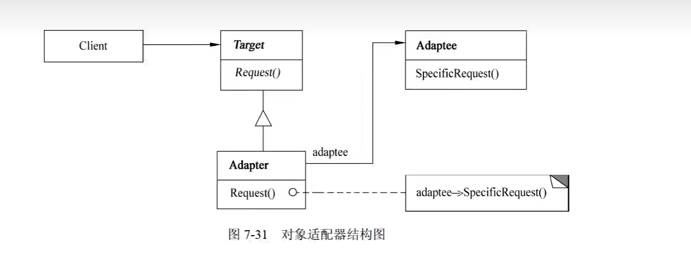

其中：

- Target定义Client使用的与特定领域相关的接口。
- Client与符合Target接口的对象协同。
- Adaptee定义一个已经存在的接口，这个接口需要适配。
- Adapter对Adaptee的接口与Target接口进行适配。

3）适用性

Adapter 模式适用于：

- **想使用一个已经存在的类，而它的接口不符合要求。**
- 想创建一个可以服用的类，该类可以与其他不相关的类或不可预见的类（即那些接口可能不一定兼容的类)协同工作。（了解）
- (仅适用于对象Adapter)想使用一个已经存在的子类，但是不可能对每一个都进行子
  类化以匹配它们的接口。对象适配器可以适配它的父类接口。（了解）

#### 2. Bridge（桥接）

1）意图

将抽象部分与其实现部分分离，使它们都可以独立地变化。

2）结构

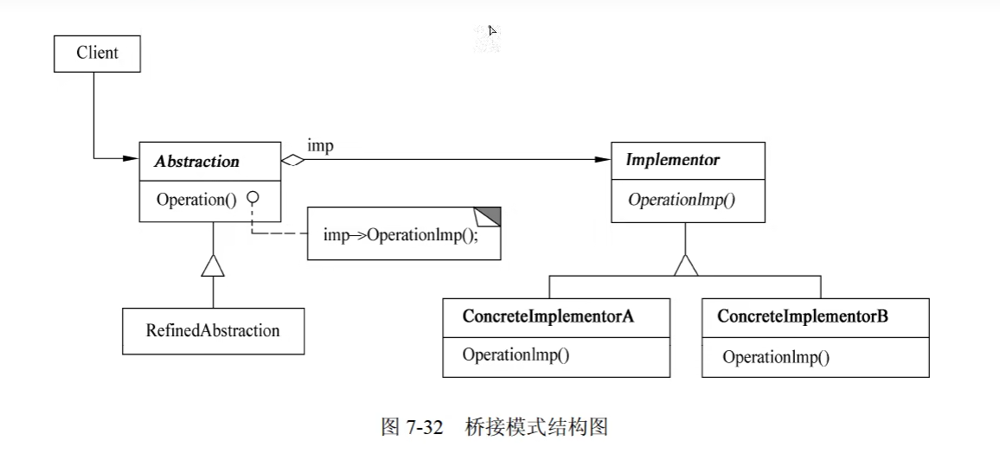

3）适用性（了解）

- 不希望在抽象和它的实现部分之间有一个固定的绑定关系。
- 类的抽象以及它的实现都应该可以通过生成子类的方法加以扩充。
- 对一个抽象的实现部分的修改应对客户不产生影响，即客户代码不必重新编译。(C++)想对客户完全隐藏抽象的实现部分。
- 有许多类要生成的类层次结构。
- 想在多个对象间共享实现（可能使用引用计数），但同时要求客户并不知道这一点。

#### 3. Composite（组合）

1）意图

将对象组合成树型结构以表示“部分-整体”的层次结构。Composite 使得用户对单个对象
和组合对象的使用具有一致性。

2）结构

​ 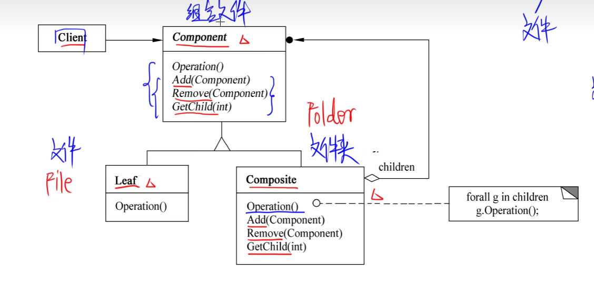

其中：

- Component 为组合中的对像声明接口：在适当情况下实现所有类共有接口的默认行为：声明一个接口用于访问和管理 Component 的子组件；（可选）在递归结构中定义一个接口，用于访问一个父组件，并在合适的情况下实现它。
- Leaf 在组合中表示叶结点对象，叶结点没有子结点；在组合中定义图元对象的行为。
- Composite定义有子组件的那些组件的行为；存储子组件；在Component接口中实现与子组件有关的操作。
- Client 通过 Component 接口操纵组合组件的对象。

3）适用性

Composite 模式下适用于：

- 想表示对象的部分-整体层次结构。
- 希望用户忽略组合对象与单个对象的不同，用户将统一地使用组合结构中的所有对象。

#### 4. Decorator（装饰器）

1）意图

动态地给一个对象添加一些额外的职责。就增加功能而言，Decorator模式比生成子类更加灵活。

2）结构

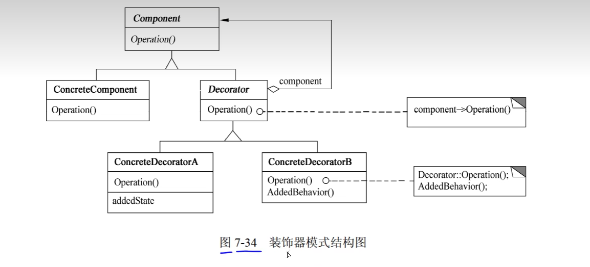

其中：

- Component定义一个对象接口，可以给这些对象动态地添加职责。
- ConcreteComponent定义一个对象，可以给这个对象添加一些职责。
- Decorator 维持一个指向 Component 对象的指针，并定义一个与Component 接口一致的接口。
- ConcreteDecorator 向组件添加职责。

3）适用性

Decorator 模式适用于：

- 在不影响其他对象的情况下，以动态、透明的方式给单个对象添加职责。
- 处理那些可以撤销的职责。
- 当不能采用生成子类的方式进行扩充时。一种情况是，可能有大量独立的扩展，为支持每一种组合将产生大量的子类，使得子类数目呈爆炸性增长。另一种情况可能是，由于类定义被隐藏，或类定义不能用于生成子类。（了解）

#### 5. Facade（外观）

1）意图

为子系统中的一组接口提供一个一致的界面，Facade 模式定义了一个高层接口，这个接口使得这一子系统更加容易使用。

2）结构

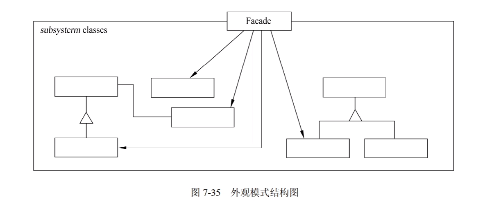

其中：

- Facade知道哪些子系统类负责处理请求；将客户的请求代理给适当的子系统对象。
- Subsystem classes实现子系统的功能；处理有Facade对象指派的任务；没有Facade的任何相关信息，即没有指向Facade的指针。

3）适用性

Facade 模式适用于：

- 要为一个复杂子系统提供一个简单接口时。
- 客户程序与抽象类的实现部分之间存在着很大的依赖性。
- 当需要构建一个层次结构的子系统时，使用 Facade 模式定义子系统中每层的入口点。

#### 6. Flyweight（享元）

1）意图

运用共享技术有效地支持大量细粒度的对象。

2）结构

​ 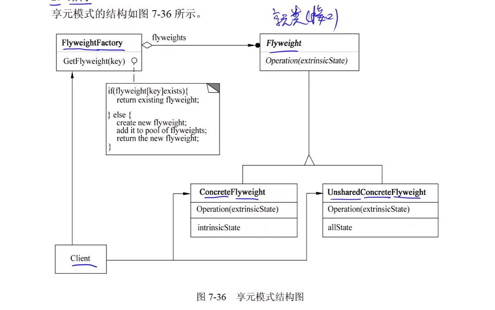

其中：

- Flyweight 描述一个接口，通过这个接口 Flyweight 可以接受并作用于外部状态。
- ConcreteFlyweight 实现Flyweight接口，并为内部状态（如果有）增加存储空间。
- ConcreteFlyweight 对象必须是可共享的。它所存储的状态必须是内部的，即它必须独立于 ConcreteFlyweight 对象的场景。
- 并非所有的 Flyweight 子类都需要被共享。Flyweight 接口使共享成为可能，但它并不强制共享。在 Flyweight 对象结构的某些层次，UnsharedConcreteFlyweight 对象通常将ConcreteFlyweight 对象作为子结点。
- FlyweightFactory 创建并管理Flyweight对象；确保合理地共享Flyweight,当用户请求一个Flyweight时，FlyweightFactory 对象提供一个已创建的实例或者在不存在时创建个实例。
- Client 维持一个对 Flyweight 的引用；计算或存储一个或多个 Flyweight 的外部状态。

3）适用性

Flyweight模式适用于：

- 一个应用程序使用了大量的对象。
- 完全由于使用大量的对象，造成很大的存储开销。
- 对象的大多数状态都可变为外部状态。
- 如果删除对象的外部状态，那么可以用相对较少的共享对象取代很多组对象。
- 应用程序不依赖于对象标识。由于Flyweight对象可以被共享，所以对于概念上明显有别的对象，标识测试将返回真值。

#### 7. Proxy(代理)

1）意图

为其他对象提供一种代理以控制对这个对象的访问。

2）结构

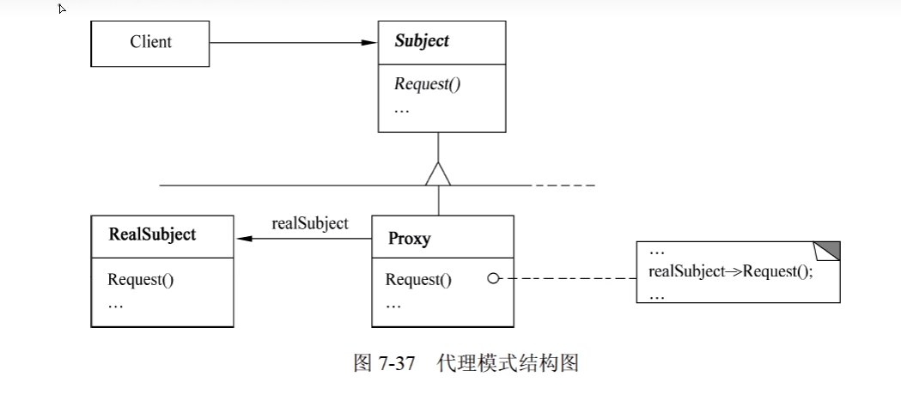

3）适用性 (了解)
Poxy模式适用于在需要比较通用和复杂的对象指针代替简单的指针的时候，常见情况有：

- 远程代理(Remote Proxy)为一个对象在不同地址空间提供局部代表。
- 虚代理(Virtual Proxy)根据需要创建开销很大的对象。
- 保护代理(Protection Proxy)控制对原始对象的访问，用于对象应该有不同的访问权限的时候。
- 智能引用(Smart Reference)取代了简单的指针，它在访问对象时执行一些附加操作。

### 行为设计模式（11种）

#### 1. Chain of Responsibility（责任链）

1）意图

**使多个对象都有机会处理请求**，从而避免请求的发送者和接收者之间的耦合关系。**将这些对象连成一条链**，并沿着这条链传递该请求，直到有一个对象处理它为止。

2）结构

​ 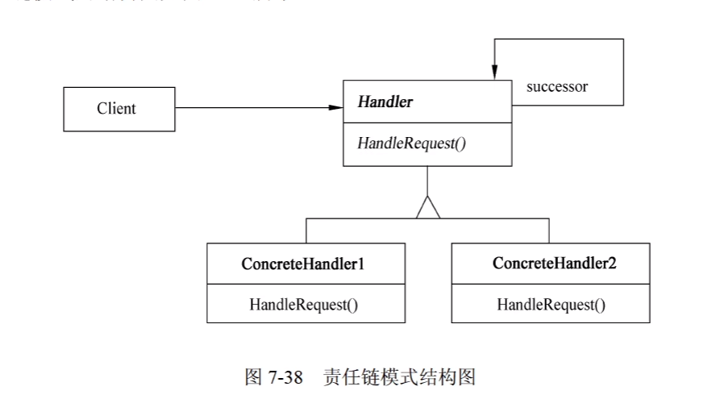

其中：

- Handler定义一个处理请求的接口；（可选）实现后继链。
- ConcreteHandler处理它所负责的请求；可访问它的后继者；如果可处理该请求，就处理它，否则将该请求转发给后继者。
- Client向链上的具体处理者(ConcreteHandler)对象提交请求。

Chain of Responsibility 模式适用于以下条件：

- 有多个的对象可以处理一个请求，哪个对象处理该请求运行时刻自动确定。
- 想在不明确指定接收者的情况下向多个对象中的一个提交一个请求。
- 可处理一个请求的对象集合应被动态指定。

#### 2.  Command（命令）

1）意图

将一个请求封装为一个对象，从而使得可以用不同的请求对客户进行参数化；对**请求排队**或记录**请求日志**，以及支持可**撤销**的操作。

2）结构

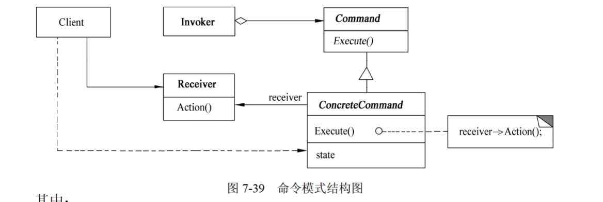

其中：

- Command声明执行操作的接口。
- ConcreteCommand 将一个接收者对象绑定于一个动作：调用接收者相应的操作，以实现Execute。
- Client 创建一个具体命令对象并设定它的接收者。
- Invoker 要求该命令执行这个请求。
- Receiver 知道如何实施与执行一个请求相关的操作。任何类都可能作为一个接收者。

3）适用性

Command 模式适用于：

- 抽象出待执行的动作以参数化某对象。
- 在不同的时刻指定、排列和执行请求。
- 支持取消操作。
- 支持修改日志。
- 用构建在原语操作上的高层操作构造一个系统。

#### 3. Interpreter（解释器）

1）意图

给定一个语言，定义它的文法的一种表示，并定义一个解释器，这个解释器使用该表示来
解释语言中的句子。

3）适用性

Interpreter模式适用于当有一个语言需要解释执行，并且可将该语言中的句子表示为一个抽象语法树时，以下情况效果最好：

- 该文法简单。对于复杂的发文，文法的类层次变得庞大而无法管理。
- 效率不是一个关键问题。最高效的解释器通常不是通过直接解释语法分析树实现的，而是首先将它们转换成另一种形式。

#### 4. Iterator（迭代器）

1）意图

提供一种方法顺序访问一个聚合对象中的各个元素，且不需要暴露该对象的内部表示。

2）结构

​ 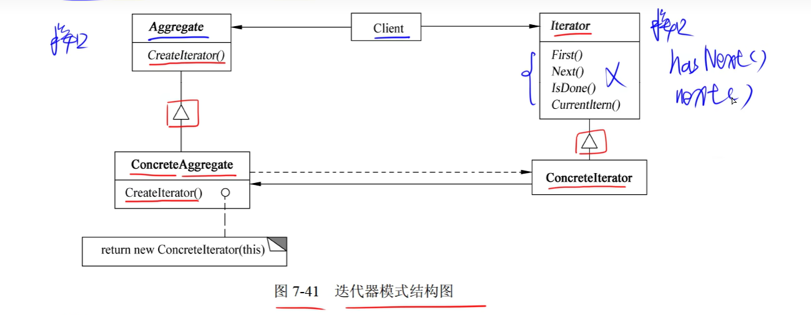

其中：

- Iterator (迭代器)定义访问和遍历元素的接口。
- ConcreteIterator(具体迭代器)实现迭代器接口；对该聚合遍历时跟踪当前位置。
- Aggregate( 聚合)定义创建相应迭代器对象的接口。
- ConcreteAggregate (具体聚合)实现创建相应迭代器的接口，该操作返回 ConcreteIterator的一个适当的实例。

3）适用性

Iterator 模式适用于：

- 访问一个聚合对象的内容而无须暴露它的内部表示。
- 支持对聚合对象的多种遍历。
- 为遍历不同的聚合结构提供一个统一的接口。

#### 5. Mediator（中介者）

1）意图

用一个中介对象来封装一系列的对象交互。中介者使各对象不需要显式的相互引用，从而使其耦合松散，而且可以独立地改变它们之间的交互。

2）结构

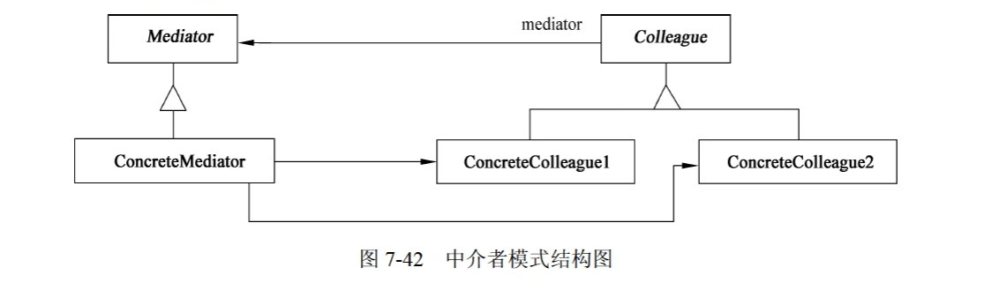

其中：

- Mediator (中介者)定义一个接口用于各同事(Colleague)对象通信。
- ConcreteMediator (具体中介者)通过协调各同事对象实现协作行为；了解并维护它的各个同事。
- Colleague class (同事类)知道它的中介者对象；每一个同事类对象在需要与其他同事通信的时候与它的中介者通信。

3）适用性

Mediator 模式适用于：

- 一组对象以定义良好但是复杂的方式进行通信，产生的相互依赖关系结构混乱且难以理解。
- 一个对象引用其他很多对象并且直接与这些对象通信，导致难以复用该对象。
- 想定制一个分布在多个类中的行为，而又不想生成太多的子类。

#### 6. Memento（备忘录）

1）意图

在不破坏封装性的前提下捕获一个对象的内部状态，并在对象之外保存这个状态。这样以后就可以将对象恢复到原先保存的状态。

2）结构

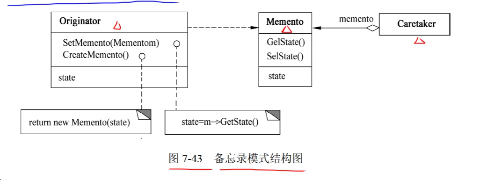

3）适用性

Mement 模式适用于：

- 必须保存一个对象在某一个时刻的（部分）状态，这样以后需要时它才能恢复到先前的状态。
- 如果一个用接口来让其他对象直接得到这些状态，将会暴露对象的实现细节并破坏对象的封装性。

#### 7. Observer（观察者）

1）意图

定义对象间的一种一对多的依赖关系，当一个对象的状态发生改变时，所有依赖于它的对象都得到通知并被自动更新。

2）结构

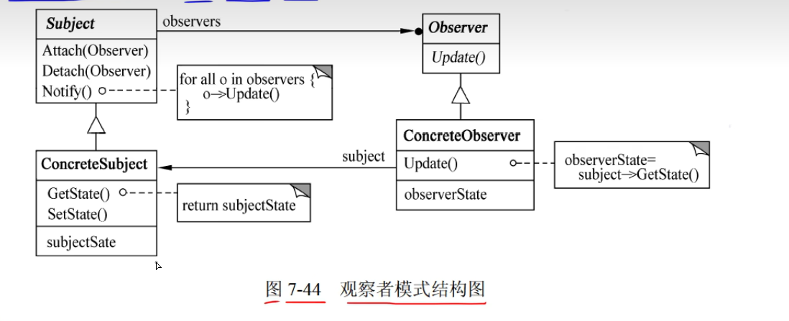

其中：

- Subject(目标)知道它的观察者，可以有任意多个观察者观察同一个目标；提供注册和删除观察者对象的接口。
- Observer(观察者)为那些在目标发生改变时需获得通知的对象定义一个更新接口。
- ConcreteSubject(具体目标)将有关状态存入各ConcreteObserver对象；当它的状态发生改变时，向它的各个观察者发出通知。
- ConcreteObserver (具体观察者)维护一个指向 ConcreteSubject 对象的引用；存储有关状态，这些状态应与目标的状态保持一致
- 实现 Observer 的更新接口，以使自身状态与目标的状态保持一致。

3）适用性

Observer 模式适用于：

- 当一个抽象模型有两个方面，其中一个方面依赖于另一个方面，将这两者封装在独立的对象中以使它们可以各自独立地改变和复用。
- 当对一个对象的改变需要同时改变其他对象，而不知道具体有多少对象有待改变时。
- 当一个对象必须通知其他对象，而它又不能假定其他对象是谁，即不希望这些对象是紧耦合的。

#### 8. State（状态）

1）意图

允许一个对象在其内部状态改变时改变它的行为。对象看起来似乎修改了它的类。

2）结构

​ 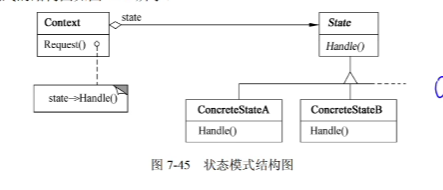

3）适用性

State 模式适用于：

- 一个对象的行为决定于它的状态，并且它必须在运行时刻根据状态改变它的行为。
- 一个操作中含有庞大的多分支的条件语句，且这些分支依赖于该对象的状态。这个状态常用一个或多个枚举常量表示。

#### 9. Strategy（策略）

1）意图

定义一系列的算法，把它们一个个封装起来，并且使它们可以相互替换。此模式使得算法可以独立于使用它们的客户而变化。

2）结构

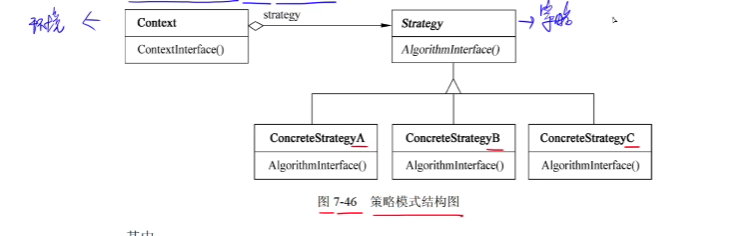

3）适用性

Strategy 模式适用于：

- 许多相关的类仅仅是行为有异。
- 需要使用一个算法的不同变体。
- 算法使用客户不应该知道的数据。可使用策略模式以避免暴露复杂的、与算法相关的数据结构。
- 一个类定义了多种行为，并且这些行为在这个类的操作中以多个条件语句的形式出现，将相关的条件分支移入它们各自的 Strategy 类中，以代替这些条 件语句。

#### 10. Template Method（模板方法）

1）意图

定义一个操作中的算法骨架，而将一些步骤延迟到子类中。Template Method 使得子类可以不改变一个算法的结构即可重定义该算法的某些特定步骤。

2）结构

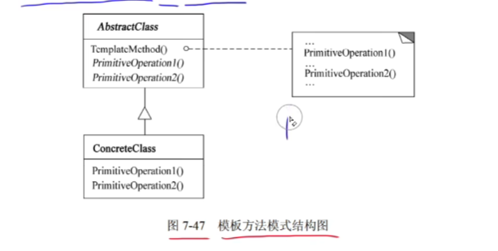

其中：

- AbstractClass（抽象类）定义抽象的原语操作，具体的子类将重定义它们以实现一个算法的各步骤；实现模板方法，定一个算法的骨架，该模板方法不仅调用原语操作，也调用定义在 AbstractClass 或其他对象中的操作。
- ConcreteClass（具体类）实现原语操作以完成算法中与特定子类相关的步骤。

3）适用性

Template Method 模式适用于：

- 一次性实现一个算法的不变的部分，并将可变的行为留给子类来实现。
- 各子类中公共的行为应被提取出来并集中到一个公共父类中，以避免代码重复。
- 控制子类扩展：模板方法在特定点调用“hook”操作(默认行为，子类可以在必要时进行重定义扩展)，这就只允许在这些点进行扩展。

#### 11. Visitor（访问者）

1）意图

表示一个作用于某对象结构中的各元素的操作。它允许在不改变各元素的类的前提下定义作用于这些元素的新操作。

2）结构

​ 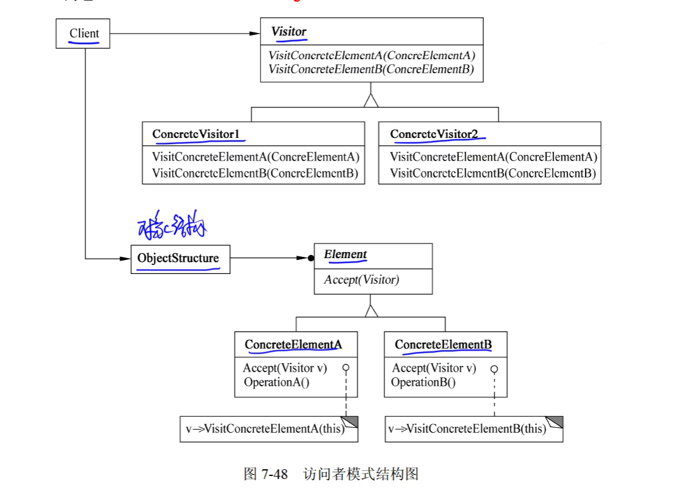

其中：

- Visitor(访问者)为该对象结构中 ConcreteElement 的每一个类声明一个 Visit 操作。该操作的名字和特征标识了发送 Vist 请求给该访问者的那个类，这使得访问者可以确定正被访问元素的具体的类。这样访问者就可以通过该元素的特定接口直接访问它。
- ConcreteVisitor (具体访问者)实现每个有 Visitor 声明的操作，每个操作实现本算法的一部分，而该算法片段乃是对应于结构中对象的类。Concrete Visitor为该算法提供了上下文并存储它的局部状态。这一状态常常在遍历该结构的过程中累积结果。
- Element (元素)定义以一个访问者为参数的 Accept 操作。
- ConcreteElement (具体元素)实现以一个访问者为参数的 Accept 操作。
- ObjectStructure (对象结构)能枚举它的元素；可以提供一个高层的接口以允许该访问者访问它的元素；可以是一个组合或者一个集合，如一个列表或一个无序集合。

3）适用性

Visitor 模式适用于：

- 一个对象结构包含很多类对象，它们有不同的接口，而用户想对这些对象实施一些依赖于其具体类的操作。
- 需要对一个对象结构中的对象进行很多不同的并且不相关的操作，而又想要避免这些操作“污染”这些对象的类。
- 定义对象结构的类很少改变，但经常需要在此结构上定义新的操作。
